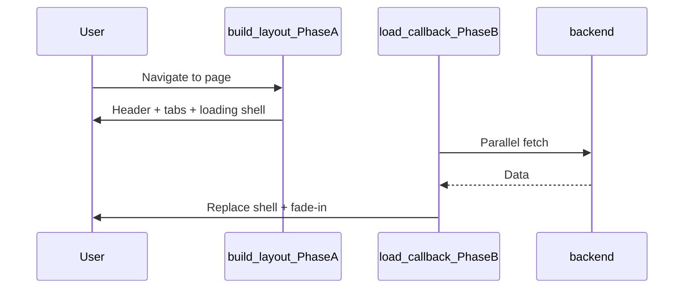

# Loading UX Design Standard (Platform GUI)

This document is the **canonical reference** for psychology-focused loading screens in Datalake-Platform-GUI. When adding or redesigning a page that waits on multi-source backend data, start here before inventing a new pattern.

**Reference implementation:** Customer View (`/customer-view?customer=…`) — commit lineage `feature/customer-crm-ux-revamp` (`6ff6aa5`+).

Related: [FRONTEND_PERFORMANCE.md](FRONTEND_PERFORMANCE.md) | [[02-Module-Platform-GUI]] (knowledge base)

---

## 1. Design goals

| Goal | Rationale |
|------|-----------|
| **Reduce perceived wait** | Users judge speed psychologically; a structured placeholder feels faster than a blank page or generic spinner (NN/G, LogRocket). |
| **Prevent “is it broken?” anxiety** | Neutral, active copy + motion signal that work is in progress — never an empty white canvas or error-like silence. |
| **Preview final layout** | Skeleton blocks mirror real cards/columns so cognitive load stays low when content arrives. |
| **Preserve context** | Page chrome (header, tabs, entity name) renders **immediately**; only the data region is deferred. |
| **Do not replace performance work** | Loading UX complements cache warm-up and parallel fetch — it does not fix slow APIs by itself. |

---

## 2. When to use this pattern

| Scenario | Recommended pattern |
|----------|---------------------|
| Full page waiting on **multiple API calls** (≥2 s typical) | **Two-phase shell + skeleton** (this standard) |
| Single widget / panel refresh | `dcc.Loading` on that panel only ([Global View detail panel](../src/pages/global_view.py)) |
| Action in progress (save, export, delete) | Button spinner or inline progress — **not** full-page skeleton |
| Load consistently **&lt; 400 ms** (hot cache) | Optional: skip skeleton to avoid flash (NN/G); fade-in only |
| Long deterministic job (&gt; 10 s, known steps) | Progress bar or step wizard — not indeterminate skeleton |

---

## 3. Psychology tactics (applied in Customer View)

| Tactic | How we apply it | Avoid |
|--------|-----------------|-------|
| **Skeleton over spinner** (full-page content) | `dmc.Skeleton` blocks shaped like metric cards and section cards | Full-screen purple `dcc.Loading` circle alone |
| **Structural honesty** | 5-column metric grid + 2 section blocks match Summary tab layout | Random grey rectangles unrelated to final UI |
| **Zeigarnik / staged progress** | Rotating status lines every 2.2 s (`customer-loading-status`) | Static “Loading…” forever |
| **Contextual reassurance** | Customer name + domain icon + bouncing dots | Generic “Please wait” |
| **Shimmer motion** | `.customer-load-shimmer::after` reuses `@keyframes dc-shimmer` | Frozen skeleton with no motion |
| **Expectation setting** | Footer: “This usually takes a few seconds on first visit.” | Implying failure or slowness is abnormal |
| **Completion cue** | `.customer-page-enter` fade-in when real content replaces shell | Hard swap with layout jump |

**External references:** [NN/G — Skeleton Screens 101](https://www.nngroup.com/articles/skeleton-screens/), [LogRocket — skeleton loading design](https://blog.logrocket.com/ux-design/skeleton-loading-screen-design/).

---

## 4. Reference implementation map

| Layer | File | Responsibility |
|-------|------|----------------|
| **Shell builder** | [`src/components/customer_loading.py`](../src/components/customer_loading.py) | Reusable loading layout: hero, skeletons, interval hook |
| **Instant layout** | [`src/pages/customer_view.py`](../src/pages/customer_view.py) | `build_customer_layout()` — no API calls; renders loading shell inside `customer-view-page-root` |
| **Async fill** | [`src/pages/customer_view_callbacks.py`](../src/pages/customer_view_callbacks.py) | `load_customer_view_data` replaces shell; `rotate_customer_loading_status` cycles copy |
| **Styles** | [`assets/style.css`](../assets/style.css) | `.customer-loading-*`, `.customer-load-shimmer` |
| **Prior art** | [`src/pages/global_view.py`](../src/pages/global_view.py) | `#building-reveal-layer`, `.building-reveal-dots` — hero + dots pattern |

---

## 5. Visual specification

### 5.1 Color tokens (align with platform UI)

| Token | Value | Usage |
|-------|-------|-------|
| Primary indigo | `#4318FF` | Hero icon |
| Headline text | `#2B3674` | Entity name (customer) |
| Muted text | `#A3AED0` | Status line, helper copy |
| Card surface | `#fff` | Skeleton card background |
| Card border | `#eef1f4` | Skeleton card outline |
| Page background | `#F4F7FE` | Inherited from main shell |

Font: **DM Sans** (global Mantine theme).

### 5.2 Layout anatomy

```
┌─────────────────────────────────────────────────────────┐
│  Detail header (title, back link, tabs, time range)      │  ← Phase A: immediate
├─────────────────────────────────────────────────────────┤
│  Intro / context card (entity name, short description)   │  ← Phase A: immediate
├─────────────────────────────────────────────────────────┤
│  HERO: icon (float) + entity name + status + ● ● ●      │  ← Loading layer
│  METRICS: 5 × skeleton cards (responsive grid)           │
│  SECTIONS: 2 × skeleton panels                           │
│  FOOTER: expectation hint (xs, dimmed)                   │
└─────────────────────────────────────────────────────────┘
         ↓ async callback completes ↓
┌─────────────────────────────────────────────────────────┐
│  Full tab panels with real data + customer-page-enter    │  ← Phase B
└─────────────────────────────────────────────────────────┘
```

### 5.3 Motion

| Element | CSS | Duration |
|---------|-----|----------|
| Hero icon float | `buildingFloat` (shared with Global View) | 1.8 s ease-in-out infinite |
| Shimmer sweep | `dc-shimmer` on `.customer-load-shimmer::after` | 1.4 s ease-in-out infinite |
| Status rotation | `dcc.Interval` | 2200 ms |
| Content reveal | `customer-page-enter` | 0.35 s ease-out |

### 5.4 Copy guidelines

1. **Status lines** — verb + domain object; neutral tone; end with ellipsis (`…`).
2. **Rotate 3–5 messages** — enough variety without feeling fake; order loosely matches fetch domains.
3. **Footer hint** — one sentence; sets time expectation without apologizing.
4. **Never** show error styling, “0 results”, or empty tables during load.
5. **Entity name** — always show what is loading (customer name, DC id, etc.).

Customer View stage messages (extend in `LOADING_STAGE_MESSAGES`):

- Preparing customer dashboard…
- Loading billing assets…
- Fetching availability metrics…
- Loading backup and storage data…

---

## 6. Technical architecture (two-phase render)



### 6.1 Phase A — synchronous layout (no blocking I/O)

- `render_main_content` (or page `build_layout`) returns immediately.
- Include: header, navigation context, `dcc.Store` for permissions/export state.
- Place loading shell in a single replaceable root: `id="customer-view-page-root"`.

### 6.2 Phase B — Dash callback

- **Inputs:** `url.pathname`, `url.search`, `app-time-range` (and other filters as needed).
- **Outputs:** replaceable content root + any stores (export metadata, etc.).
- Use `ThreadPoolExecutor` inside callback for independent HTTP calls ([FRONTEND_PERFORMANCE.md §2.1](FRONTEND_PERFORMANCE.md)).
- `prevent_initial_call=False` on load callback so first paint triggers fetch.

### 6.3 Component IDs (contract)

| ID | Role |
|----|------|
| `customer-view-page-root` | Replaced by load callback (shell → full page) |
| `customer-loading-layer` | Root of loading shell |
| `customer-loading-status` | Rotating status text |
| `customer-loading-stage-interval` | Interval driving status rotation |
| `customer-view-visible-sections` | Permission context for Phase B render |

New pages should follow `{page}-page-root`, `{page}-loading-layer`, `{page}-loading-status` naming.

### 6.4 What not to do

- Do **not** wrap the entire page in `dcc.Loading` without a callback updating its children ( ineffective — see pre-refactor Customer View ).
- Do **not** rely on `main-content-loading` alone for heavy pages; shell + skeleton is the primary UX.
- Do **not** block `render_main_content` with sequential API calls when a shell is shown.

---

## 7. Checklist for new loading screens

- [ ] Read this doc and inspect `customer_loading.py`.
- [ ] Identify final page layout; sketch skeleton blocks that match real components.
- [ ] Split layout builder (Phase A) from data callback (Phase B).
- [ ] Add hero: contextual icon + entity label + status + dots.
- [ ] Add 3–5 rotating status messages tied to real fetch domains.
- [ ] Add shimmer class to skeleton containers (reuse `.customer-load-shimmer` or page-specific BEM).
- [ ] Add one-line expectation footer for first-visit / cold-cache paths.
- [ ] Apply `.{page}-page-enter` (or reuse `customer-page-enter`) on content reveal.
- [ ] Parallelize independent API calls in Phase B callback.
- [ ] Add smoke test: layout contains loading IDs; callback returns non-skeleton when mocked.
- [ ] Link implementation in [[02-Module-Platform-GUI]] if user-facing.

---

## 8. Reuse and extension

### 8.1 Extracting a shared module (future)

When a second page adopts this pattern, consider:

```
src/components/loading_shell.py
  build_loading_hero(title, icon, stages)
  build_metric_skeleton(cols=5)
  build_section_skeleton(height=200)
```

Until then, **copy the Customer View structure** and adjust skeleton counts — do not invent a one-off spinner page.

### 8.2 Shared CSS

Reuse these classes before adding new ones:

- `.building-reveal-dots` / `.brd-dot` — activity indicator
- `.customer-load-shimmer` — shimmer overlay (rename to `.loading-shimmer` when generalized)
- `@keyframes buildingFloat`, `@keyframes dc-shimmer`

### 8.3 Sibling patterns in the codebase

| Pattern | Location | Use when |
|---------|----------|----------|
| Building reveal overlay | `global_view.py` + `#building-reveal-layer` | Full-screen transitional moment (globe → building) |
| Panel `dcc.Loading` | `global_view.py` `detail-loading` | Partial panel async fill |
| Query catalog skeleton | `query_explorer.py` | Static placeholder in layout (not async two-phase) |

---

## 9. Testing

| Test | File |
|------|------|
| Loading shell structure / IDs | [`tests/test_customer_loading_shell.py`](../tests/test_customer_loading_shell.py) |
| Layout has async roots | same |
| Callback load (future) | `tests/test_customer_view_callbacks.py` — mock `_customer_content` |

Manual: cold cache → skeleton visible ≥300 ms → smooth fade to content; hot cache → minimal flash acceptable.

---

## 10. Changelog

| Date | Change |
|------|--------|
| 2026-06-07 | Initial standard documented from Customer View loading shell (`customer_loading.py`, tiered cache UX work). |
