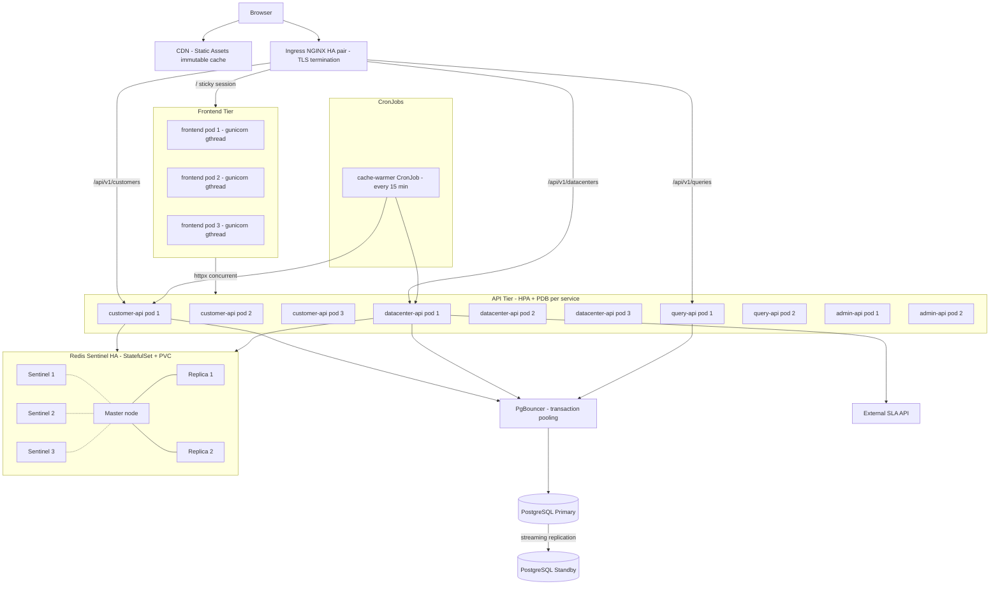

# Production Architecture: High Availability & Performance

This document describes the target production topology for Datalake-Platform-GUI at scale (100+ customers, zero-downtime deployments, low TTFB). It supersedes the development-focused topology described in [TOPOLOGY_AND_SETUP.md](TOPOLOGY_AND_SETUP.md) and provides binding guidance for infrastructure, caching, and operational decisions.

Related documents:
- [CACHE_STRATEGY_COMPARISON.md](CACHE_STRATEGY_COMPARISON.md) — cache semantics and TTL policy details
- [FRONTEND_PERFORMANCE.md](FRONTEND_PERFORMANCE.md) — browser cache, Dash callback optimisations
- [TOPOLOGY_AND_SETUP.md](TOPOLOGY_AND_SETUP.md) — local and Docker Compose setup
- ADR-0007: `datalake-platform-knowledge-base/adrs/ADR-0007-production-ha-cache-architecture.md`

---

## 1. Service Level Objectives (SLO)

| Signal | Target |
|--------|--------|
| Customer view TTFB p95 (warm cache) | < 800 ms |
| Customer view TTFB p95 (cold / stale-serve fallback) | < 2 500 ms |
| API error rate (5xx) | < 0.1 % |
| Monthly availability | ≥ 99.9 % |
| Redis failover time (Sentinel) | < 30 s |
| Rolling deployment downtime | 0 s (maxUnavailable=0) |

Scale assumption: 100+ customers × 4 preset time ranges (`1h / 1d / 7d / 30d`) ≈ 800 primary Redis keys + 800 `last_good` shadow keys = ~1 600 total keys, avg 100 KB each → ~160 MB Redis working set.

---

## 2. Target production topology



---

## 3. Infrastructure requirements (reference sizing for 100+ customers)

Revise after load testing with the k6 scenarios in `loadtest/`. Numbers assume no CDN for API traffic.

### 3.1 Kubernetes worker nodes

| Tier | Nodes | vCPU / Node | RAM / Node | Notes |
|------|-------|-------------|-----------|-------|
| API | 3 | 4 | 16 GB | Hosts customer-api, datacenter-api, query-api, admin-api pods. HPA headroom included. |
| Redis | 3 | 2 | 8 GB | Separate nodes, one per AZ. Redis master gets 2 GB RSS + OS overhead. |
| Frontend | 2 | 2 | 8 GB | Gunicorn gthread workers, sticky sessions via NGINX Ingress cookie. |

**Total minimum:** 8 worker nodes. Add a dedicated node pool for CronJobs if cluster autoscaler is enabled.

### 3.2 PostgreSQL

| Parameter | Value |
|-----------|-------|
| CPU | 8 vCPU |
| RAM | 32 GB |
| `shared_buffers` | 8 GB (25 %) |
| `effective_cache_size` | 24 GB |
| `work_mem` | 64 MB (ILIKE + DISTINCT ON queries) |
| `max_connections` | 100 (PgBouncer handles the rest) |
| `pg_stat_statements` | enabled |
| Streaming replica | 1 hot standby |

### 3.3 Redis (Sentinel cluster)

| Parameter | Value |
|-----------|-------|
| `maxmemory` | 2 GB (master) |
| `maxmemory-policy` | `allkeys-lru` |
| Persistence | AOF `everysec` + RDB every 15 min |
| Auth | `requirepass` + `masterauth` (K8s Secret) |
| TLS | mTLS between master/replica/sentinel |
| ACL | Separate ACL users per service (`customer-api`, `datacenter-api`) |
| Sentinel quorum | 2 (3 sentinels) |

### 3.4 Software versions

| Component | Version |
|-----------|---------|
| Python (microservices) | 3.11 |
| Python (frontend Dash) | 3.11 (align from 3.10 — see ADR-0007) |
| Redis | 7.x |
| PostgreSQL | 15.x |
| NGINX Ingress Controller | 1.10+ |
| Kubernetes | 1.28+ |
| Gunicorn | 21+ |

---

## 4. High Availability design

### 4.1 Deployment strategy

All services use `RollingUpdate` with `maxSurge: 1` and `maxUnavailable: 0`. The readiness gate blocks traffic until the pod reports healthy.

```yaml
strategy:
  type: RollingUpdate
  rollingUpdate:
    maxSurge: 1
    maxUnavailable: 0
```

### 4.2 PodDisruptionBudgets

| Service | `minAvailable` | Replicas |
|---------|---------------|----------|
| customer-api | 2 | 3 |
| datacenter-api | 2 | 3 |
| query-api | 1 | 2 |
| admin-api | 1 | 2 |
| frontend | 2 | 3 |
| Redis (per StatefulSet) | — | maxUnavailable: 1 |

### 4.3 HPA configuration (updated targets)

| Service | Min | Max | CPU trigger |
|---------|-----|-----|-------------|
| customer-api | 2 | 6 | 60 % |
| datacenter-api | 2 | 6 | 60 % |
| query-api | 1 | 4 | 70 % |
| frontend | 2 | 5 | 70 % |

### 4.4 Graceful shutdown

FastAPI services already implement `lifespan` shutdown (scheduler stop + pool close). Add a `preStop` hook to delay SIGTERM so the ingress has time to drain connections:

```yaml
lifecycle:
  preStop:
    exec:
      command: ["sleep", "15"]
```

### 4.5 Topology spread (anti-affinity)

Spread pods across nodes so that a single node failure does not take down a whole service:

```yaml
topologySpreadConstraints:
  - maxSkew: 1
    topologyKey: kubernetes.io/hostname
    whenUnsatisfiable: DoNotSchedule
    labelSelector:
      matchLabels:
        app: bulutistan-customer-api
```

### 4.6 Ingress HA

- Deploy NGINX Ingress with `replicas: 2` and `podAntiAffinity` across nodes.
- `proxy_next_upstream error timeout http_502 http_503` to retry on a different upstream pod on transient errors.
- `proxy-read-timeout` increased to `90s` for cold-cache customer page loads.

### 4.7 Redis Sentinel failover

Services connect via `redis.sentinel.Sentinel` client (replace the current `redis.Redis` direct connection in `redis_client.py`). On master failover Sentinel broadcasts the new master within ~10 s; the Python client reconnects automatically.

---

## 5. Caching architecture (production rules)

See [CACHE_STRATEGY_COMPARISON.md](CACHE_STRATEGY_COMPARISON.md) for full semantics. Summary for production:

### 5.1 TTL vs refresh alignment

| Parameter | Current (broken) | Target (prod) |
|-----------|-----------------|---------------|
| `CUSTOMER_DATA_CACHE_TTL_SECONDS` | 900 s | 3 600 s |
| `CLUSTER_ARCH_MAP_TTL_SECONDS` | 900 s | 3 600 s |
| `REFRESH_INTERVAL_MINUTES` | 15 min | 15 min (unchanged) |
| Ratio TTL / refresh | 1× (race condition) | 4× (4 safe write windows) |

**Effect:** with TTL=3600 and refresh=900, each key is overwritten 4 times before it can expire. If the DB is temporarily unavailable and a refresh fails, the key lives for up to 1 hour serving the last good snapshot.

### 5.2 Last-good shadow key

When the scheduler successfully writes a key, it also writes `{key}:last_good` with TTL=`7200` (2 h). On query timeout or DB failure, the service reads `{key}:last_good` before returning a 503, so users see slightly stale data instead of an error page.

### 5.3 Distributed singleflight (multi-replica)

The current `threading.Event` singleflight only deduplicates within one process. With N replicas, N concurrent cache misses each go to the DB. Replace with a Redis-based distributed lock:

```
SET cu:lock:{key} {pod_id} NX EX 30
```

Only the pod that acquires the lock runs the factory; others wait with `BLPOP cu:notify:{key} 30` or poll `GET cu:lock:{key}` every 200 ms. Alternatively, adopt a dedicated CronJob for all warming (see §5.4) so request-path singleflight is only a safety net.

### 5.4 Cache warming CronJob

Replace per-pod `warm_cache()` at startup with a Kubernetes CronJob that runs every 15 minutes and calls the API's warm endpoint. This:
- Decouples warming from pod lifecycle (HPA scale-up starts serving immediately via stale-while-revalidate).
- Runs warming exactly once per interval regardless of replica count.
- Eliminates startup cold-DB queries that currently slow first responses after a rolling deploy.

```yaml
apiVersion: batch/v1
kind: CronJob
metadata:
  name: customer-cache-warmer
spec:
  schedule: "*/15 * * * *"
  jobTemplate:
    spec:
      template:
        spec:
          containers:
            - name: warmer
              image: curlimages/curl:8
              command:
                - sh
                - -c
                - |
                  curl -sf -X POST http://bulutistan-customer-api/api/v1/internal/warm-cache \
                    -H "Authorization: Bearer $WARMER_TOKEN" || exit 1
          restartPolicy: OnFailure
```

### 5.5 Key namespace (multi-service Redis)

Sentinel operates on a single logical database. Replace `redis_db` isolation with key prefixes:

| Service | Key prefix |
|---------|-----------|
| customer-api | `cu:` |
| datacenter-api | `dc:` |

Update `cache_backend.py` to prepend the prefix automatically via a `KEY_PREFIX` setting so existing key names are unchanged in application code.

### 5.6 Redis memory budget

| Key type | Count | Avg size | Total |
|----------|-------|----------|-------|
| `cu:customer_assets:*` | 400 | 150 KB | 60 MB |
| `cu:customer_assets:*:last_good` | 400 | 150 KB | 60 MB |
| `cu:customer_s3:*` | 400 | 30 KB | 12 MB |
| `cu:customer_s3:*:last_good` | 400 | 30 KB | 12 MB |
| `cu:cluster_arch_map:*` | 4 | 10 KB | <1 MB |
| `dc:*` keys | ~200 | 80 KB | 16 MB |
| In-flight locks / notify | <100 | <1 KB | <1 MB |
| **Total** | | | **~161 MB** |

`maxmemory 2gb` gives a 12× safety margin for data growth and memory fragmentation.

---

## 6. Database optimisation (prod DB settings)

| Setting | Dev | Prod |
|---------|-----|------|
| `statement_timeout` (client) | 60 000 ms | 10 000 ms |
| `work_mem` | default | 64 MB (per session) |
| `pg_trgm` GIN index on `vm_metrics.vmname` | missing | required (ILIKE acceleration) |
| `pg_trgm` GIN index on `nutanix_vm_metrics.vm_name` | missing | required |
| PgBouncer mode | — | transaction (pool_size=25 per user) |

The 94 `ILIKE '%customer%'` patterns across customer queries cause full sequential scans on large tables. `pg_trgm` + GIN index reduces these to index scans. Evaluate via `EXPLAIN ANALYZE` before deploying (see Faz 5 roadmap).

---

## 7. Observability

The OTel SDK is already integrated ([docs/OTEL_COLLECTOR.md](OTEL_COLLECTOR.md)). For production add:

| Component | Tool | What to monitor |
|-----------|------|-----------------|
| Redis | `redis_exporter` + Prometheus | `redis_keyspace_hits_total`, `redis_memory_used_bytes`, `redis_connected_clients`, `redis_blocked_clients` |
| Cache spans | Grafana (from OTel traces) | `cache.hit`, `cache.backend`, `cache.singleflight.waited` span attributes |
| API latency | Grafana | p50/p95/p99 per route, especially `/api/v1/customers/{name}/resources` |
| DB | `pg_stat_statements` + Grafana | top 10 slowest queries, lock waits |
| Gunicorn | Prometheus multiproc | worker queue depth, request duration |

Add `latency-monitor-threshold 100` to Redis config and ship slow-log to the OTel collector for full-stack latency correlation.

---

## 8. Rollout sequence

Execute in the following order to maintain zero downtime at each step:

1. **Faz 1 — Cache hotfix** (`feature/cache-ttl-hotfix`): TTL 900→3600, `last_good` key, Redis distributed lock, CronJob stub.
2. **Faz 2 — Frontend parallelisation** (`feature/frontend-parallel-fetch`): concurrent HTTP calls, tab-lazy load, export lazy.
3. **Faz 3 — Redis HA** (`feature/redis-sentinel`): StatefulSet + Sentinel + PVC + auth + TLS + key prefix migration.
4. **Faz 4 — Scale out** (`feature/scale-out-ha`): replicas ×3, PDB, HPA tuning, ingress HA, topology spread, preStop hooks.
5. **Faz 5 — DB tuning** (`feature/db-tuning`): `statement_timeout` 10 s, `pg_trgm` indexes, PgBouncer.
6. **Faz 6 — Load test & SLO validation** (`feature/loadtest-slo`): k6 scenarios, Grafana SLO dashboard.

Each faz is an independent feature branch merged to `development`, then to `main` after approval.

---

## 9. Quick reference: key configuration values

| Config key | File | Dev | Prod |
|------------|------|-----|------|
| `CUSTOMER_DATA_CACHE_TTL_SECONDS` | `customer_service.py` | 900 | 3 600 |
| `CLUSTER_ARCH_MAP_TTL_SECONDS` | `customer_service.py` | 900 | 3 600 |
| `cache_ttl_seconds` | `config.py` | 900 | 3 600 |
| `cache_max_memory_items` | `config.py` | 200 | 500 |
| `db_statement_timeout_ms` | `config.py` | 60 000 | 10 000 |
| `redis_socket_timeout` | `config.py` | 5 s | 3 s |
| `WARMED_CUSTOMERS` | `.env` | `Boyner` | (empty — load from DB) |
| `maxmemory` | Redis config | 256 MB | 2 GB |
| Gunicorn workers | `Dockerfile` | 1 | 4 |
| Gunicorn threads | `Dockerfile` | 4 | 8 |
| Frontend replicas | `k8s/frontend/deployment.yaml` | 2 | 3 |
| customer-api replicas | `k8s/customer-api/deployment.yaml` | 1 | 3 |
| HPA minReplicas (customer-api) | `k8s/customer-api/hpa.yaml` | 1 | 2 |

---

## 10. Related documentation

| Document | Content |
|----------|---------|
| [CACHE_STRATEGY_COMPARISON.md](CACHE_STRATEGY_COMPARISON.md) | TTL semantics, stale-while-revalidate, distributed lock details |
| [FRONTEND_PERFORMANCE.md](FRONTEND_PERFORMANCE.md) | Browser cache, Dash optimisations, progressive loading |
| [TOPOLOGY_AND_SETUP.md](TOPOLOGY_AND_SETUP.md) | Local and Docker Compose setup |
| [OTEL_COLLECTOR.md](OTEL_COLLECTOR.md) | OpenTelemetry configuration |
| ADR-0007 | Architectural decisions behind this document |
