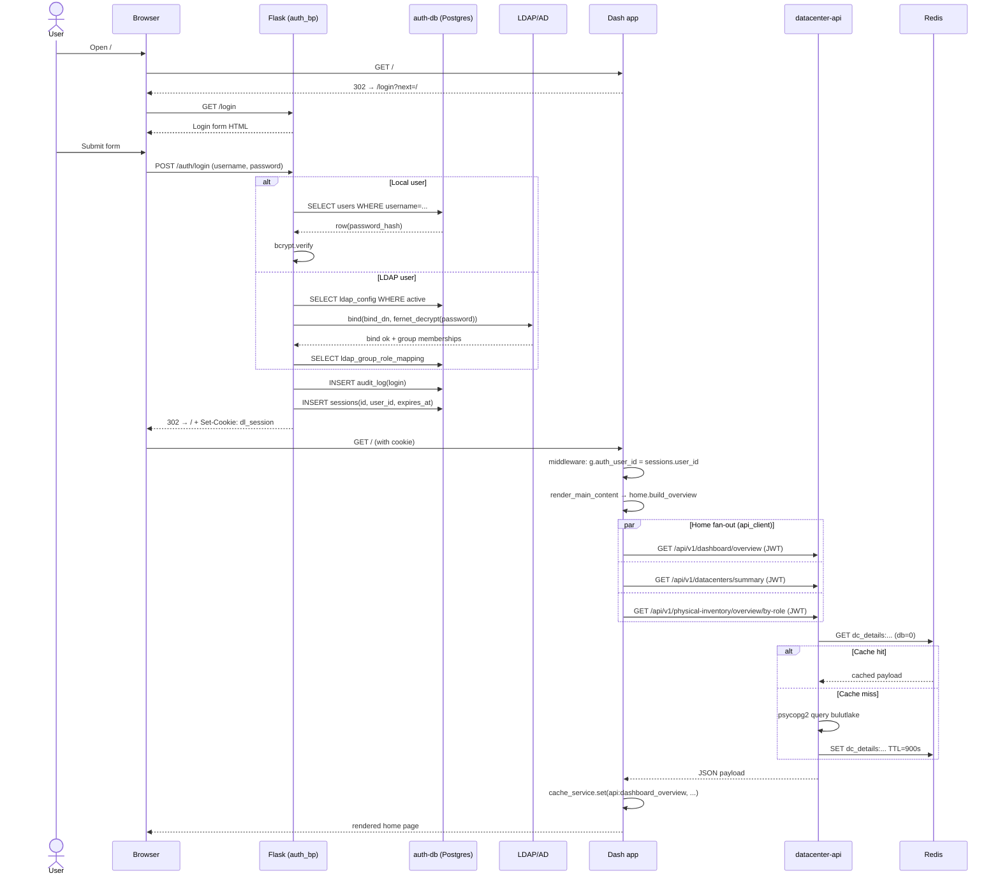
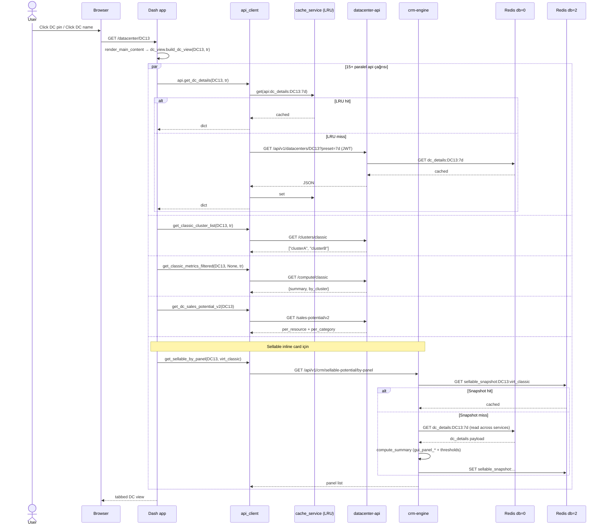
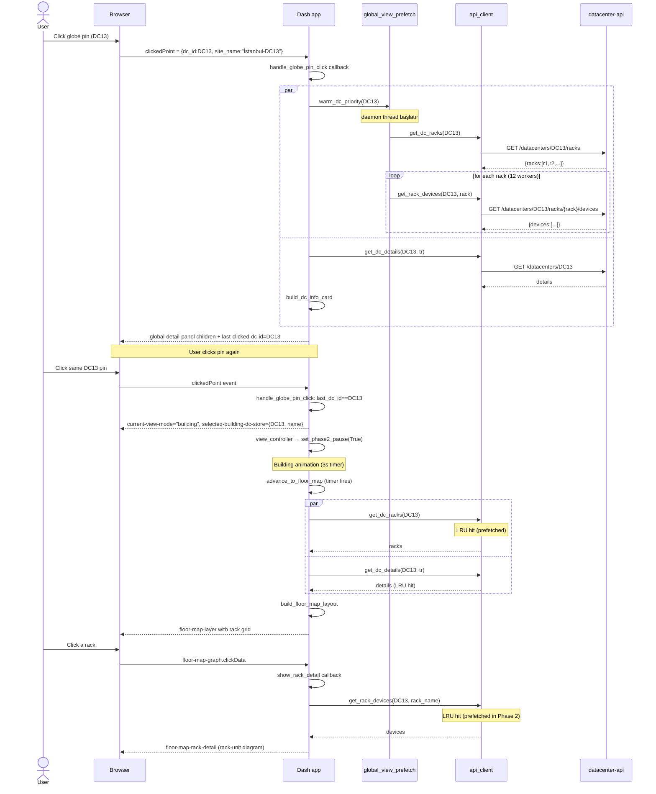
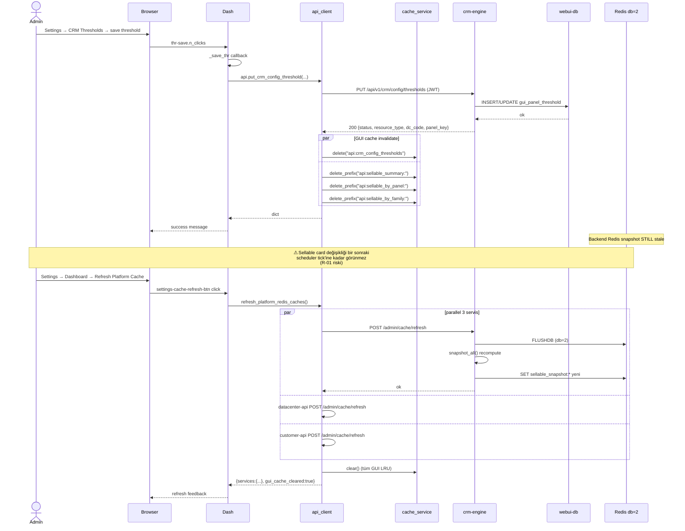
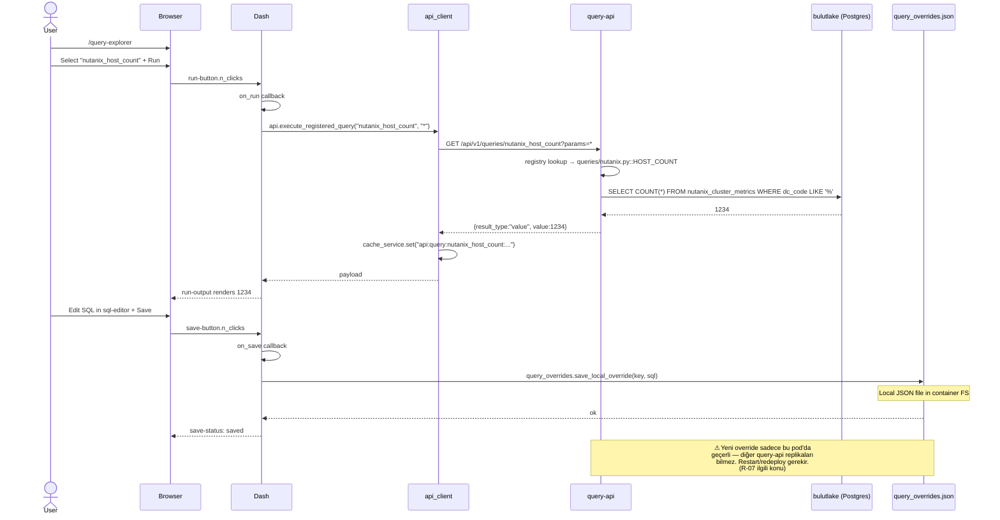

# Datalake Platform GUI — Mimari Dokümantasyonu

| Alan | Değer |
|------|-------|
| Doküman sürümü | 1.0 |
| Hazırlama tarihi | 2026-05-12 |
| Branch | `feature/customer-view-availability` (HEAD `a4fdc19`) |
| Kapsam | Frontend Dash app + 5 backend microservice + cache/scheduler/auth altyapısı |
| Doküman tipi | Mimari referansı + operasyonel rehber + gap / risk envanteri |
| Yan dosyalar | `frontend_flows.csv`, `backend_lineage.csv`, `end_to_end_master.csv`, `gaps_and_actions.md`, `drawio_blueprint.md` |

> Bu doküman, kullanıcı bir butona tıkladığı andan veritabanına yazılan veya okunan satıra kadar olan tüm yolculuğu açıklar. Her iddianın arkasında bir dosya/satır referansı veya yan CSV satırı vardır (`FE-001`, `BE-042` formatında).

---

## İçindekiler

1. [Yönetici özeti](#1-yönetici-özeti)
2. [Sistem topolojisi](#2-sistem-topolojisi)
3. [Veri katmanı](#3-veri-katmanı)
4. [Kimlik doğrulama & yetkilendirme](#4-kimlik-doğrulama--yetkilendirme)
5. [Frontend mimarisi (Dash app)](#5-frontend-mimarisi-dash-app)
6. [Sayfa bazlı akış dokümantasyonu](#6-sayfa-bazlı-akış-dokümantasyonu)
7. [Backend servisleri](#7-backend-servisleri)
8. [Cache stratejisi (4-tier stack)](#8-cache-stratejisi-4-tier-stack)
9. [Scheduler & prefetch (non-click flows)](#9-scheduler--prefetch-non-click-flows)
10. [Dış sistem entegrasyonları](#10-dış-sistem-entegrasyonları)
11. [Operasyonel runbook'lar](#11-operasyonel-runbooklar)
12. [Riskler, gap'ler ve aksiyon planı](#12-riskler-gapler-ve-aksiyon-planı)
13. [Doğrulama checklist (15 kritik akış)](#13-doğrulama-checklist-15-kritik-akış)
14. [Observability & monitoring](#14-observability--monitoring)
15. [Konfigürasyon matrisi (env var)](#15-konfigürasyon-matrisi-env-var)
16. [Veri modeli (ERD)](#16-veri-modeli-erd)
17. [CI/CD ve test stratejisi](#17-cicd-ve-test-stratejisi)
18. [Custom Dash globe component](#18-custom-dash-globe-component)
19. [Security (auth ötesinde)](#19-security-auth-ötesinde)
20. [Export pipeline (CSV/XLSX/PDF)](#20-export-pipeline-csvxlsxpdf)
21. [Sequence diagrams (5 kritik akış)](#21-sequence-diagrams-5-kritik-akış)
22. [Time-range, health probe, misc loose ends](#22-time-range-health-probe-misc-loose-ends)
23. [EK A — Endpoint kataloğu](#ek-a--endpoint-kataloğu)
24. [EK B — Glossary](#ek-b--glossary)
25. [EK C — Dosya haritası](#ek-c--dosya-haritası)

---

## 1. Yönetici özeti

Platform, Bulutistan'ın datacenter & customer telemetrisini tek bir GUI üzerinde sunan bir Dash uygulamasıdır. Mimari **stateless Dash frontend + 5 FastAPI microservice + paylaşımlı Postgres/Redis** üzerine kuruludur.

**Toplam yüzey (audit sayıları):**
- 13 ön yüz route'u, ~98 distinct user-triggered callback, 8 background warm flow.
- 5 backend microservice toplam **125 endpoint** + 38 dinamik query kaydı.
- 3 farklı Postgres veritabanı (`bulutlake`, `webui-db`, `auth-db`) + Redis (3 logical DB).
- 1 dış sistem (AuraNotify) + 1 LDAP/AD + 1 SLA API.

**Sistem nasıl çalışıyor (tek paragraf):**
Kullanıcı Dash UI'da bir butona tıklar → Dash callback `src/services/api_client.py` (78 fonksiyon) içinden uygun HTTP wrapper'ını çağırır → wrapper, request-context'teki Flask JWT'yi `Authorization: Bearer …` header'ına koyar → ilgili microservice (`datacenter-api` / `customer-api` / `crm-engine` / `query-api` / `admin-api`) router'ı isteği alır → service katmanı önce Redis cache'i kontrol eder, miss durumunda Postgres'e gider → response Pydantic model olarak serialize edilir → GUI tarafında `_api_cache_get_with_stale` yardımıyla LRU'ya yazılır ve component children olarak Dash output'a döner. Bu zincir tamamen tipik bir DC view sayfa yüklemesinde ~15 endpoint için paralel olarak tekrarlanır.

**En kritik 5 mimari noktası:**
1. **Tek API façade** — GUI'nin backend ile tek temas noktası `api_client.py`'dir. Her endpoint için tek bir wrapper vardır, her wrapper aynı cache + stale-while-error + JWT injection davranışına sahiptir.
2. **4 katmanlı cache** — GUI LRU → stale-while-error → backend Redis → backend in-process TTL fallback. Sıcak cache'te bir DC view sayfası <500ms; soğukta 8-15s.
3. **Scheduler-driven warm** — APScheduler (15m DB, 60m SLA, 30m S3/Backup, 15m customer + AuraNotify) sayesinde Redis nadiren soğur. Global view için ayrıca 2-fazlı prefetch (`global_view_prefetch.py`) çalışır.
4. **JWT propagation** — Flask login → `g.auth_user_id` → `api_client._auth_headers()` per-request HS256 token → backend `verify_api_user`. `API_AUTH_REQUIRED=false` default ile prod hardening gerekiyor.
5. **Settings PUT'ları GUI cache'i temizler, backend Redis'i temizlemez** — bilinçli operatör aksiyonu (Cache Refresh butonu) veya scheduler ticki olmadan ayar değişiklikleri sellable hesaplarına yansımayabilir.

**Hareket edilecek 5 en yüksek öncelikli iş** (detay [§12](#12-riskler-gapler-ve-aksiyon-planı)):

| # | İş | Risk ID | Etki |
|---|------|--------|------|
| 1 | Scheduler için service-account JWT | R-02 | Prod'da `API_AUTH_REQUIRED=true` açılırsa scheduler sessizce başarısız olur |
| 2 | `_client_crm` thread-local'a çevir | R-08 | gthread worker altında httpx race condition |
| 3 | Settings PUT → backend Redis flush propagation | R-01 | Operatör Cache Refresh basmazsa ayar değişiklikleri görünmez |
| 4 | Query Explorer save/add admin permission ile gate'le | R-07 | Arbitrary SQL execution surface |
| 5 | LDAP CRUD callback wiring'i belgele (low-confidence row'lar) | M-08 / L-01 | Audit eksikliği; muhtemelen çalışıyor ama doğrulanmadı |

---

## 2. Sistem topolojisi

### 2.1 Servisler

| Servis | İmaj / Build | Listen Port | URL env var | K8s service | Ingress path | Açıklama |
|--------|---|--:|---|---|---|---|
| **frontend (Dash)** | repo root `Dockerfile`, gunicorn | 8050 | `API_BASE_URL` | `bulutistan-frontend` | `/` | Dash 2 + Flask, 4 gunicorn gthread worker |
| **datacenter-api** | `services/datacenter-api/Dockerfile` | 8000 | `DATACENTER_API_URL` | `bulutistan-datacenter-api` | `/api/v1/sla`, `/api/v1/physical-inventory`, `/api/v1/datacenters`, `/api/v1/dashboard` | DC dashboard, inventory, SLA proxy |
| **customer-api** | `services/customer-api/Dockerfile` | 8000 (k8s) / 8001 (compose) | `CUSTOMER_API_URL` | `bulutistan-customer-api` | `/api/v1/customers` | Customer resources, ITSM, sales, S3 vault |
| **crm-engine** | `services/crm-engine/Dockerfile` | 8000 (k8s) / 8070 (compose) | `CRM_ENGINE_URL` | yok | yok (internal) | Sellable potential compute + CRM config CRUD |
| **query-api** | `services/query-api/Dockerfile` | 8000 (k8s) / 8002 (compose) | `QUERY_API_URL` | `bulutistan-query-api` | `/api/v1/queries` | Registry'den dinamik SQL çalıştırıcı |
| **admin-api** | `services/admin-api/Dockerfile` | 8000 (k8s) / 8060 (compose) | `ADMIN_API_URL` | yok (k8s manifesti yok) | yok | Users / roles / teams / LDAP / audit |
| **redis** | `redis:7-alpine` | 6379 / 26379 (Sentinel prod) | `REDIS_HOST` + `REDIS_PORT` | `bulutistan-redis` | yok | 3 logical DB (0/1/2) |
| **auth-db** | `postgres:15` | 5432 | `AUTH_DB_*` | yok | yok | Users/roles/audit |
| **webui-db** | `postgres:15` | 5432 | `WEBUI_DB_*` | yok | yok | gui_* tablolar; CRM config + Netbox discovery |
| **db** (opsiyonel) | `postgres:15` | 5432 | `DB_*` | yok | yok | Yerel dev (profile=`with-db`) |

### 2.2 Genel akış diyagramı (mantıksal)

```
            ┌──────────────────────────┐
            │  Browser (Dash UI)       │
            └─────────────┬────────────┘
                          │  Dash callbacks + clientside JS
                          ▼
            ┌──────────────────────────┐
            │  Gunicorn × N            │
            │  Flask + Dash app.py     │
            │  src/services/api_client │
            └─┬───┬───┬───┬───┬───┬────┘
              │   │   │   │   │   │
              │   │   │   │   │   ├──► auranotify_client ─────► AuraNotify (10.34.8.154:5001)
              │   │   │   │   │   └──► admin_client ───────────┐
              ▼   ▼   ▼   ▼   ▼                                ▼
        datacenter-api   customer-api   query-api   crm-engine    admin-api
          │ Redis db=0    │ Redis db=1   │ Redis(opt) │ Redis db=2   │
          ▼                ▼              ▼            ▼              ▼
        ┌─────────────┐  ┌───────────┐ ┌──────────┐ ┌──────────────┐ ┌──────────┐
        │ bulutlake   │  │ bulutlake │ │ bulutlake│ │ webui-db +   │ │ auth-db  │
        │ + webui-db  │  │ + webui-db│ │          │ │ datacenter-api│ │          │
        │ (Netbox/    │  │ (CRM/aliases) │ │ Redis db=0│ │          │
        │  inventory) │  │           │ │          │ │ (read-only)  │ │          │
        └─────────────┘  └───────────┘ └──────────┘ └──────────────┘ └──────────┘
                                          ▲
                                          │ Compose'da `with-db` profile
                                          │
            ┌─────────────────────────────┴────────────────────────────┐
            │  Background Scheduler (APScheduler in GUI pod)            │
            │   • DB cache refresh 15m    • S3/Backup 30m              │
            │   • SLA cache 60m           • Customer warm 15m           │
            │   • AuraNotify 15m          • Phys-inv 30m                │
            │   • Global view prefetch 900s (also triggered on render)  │
            └───────────────────────────────────────────────────────────┘
```

### 2.3 Production farkları (`docs/PROD_ARCHITECTURE.md`)
- HA replica sayıları: customer-api ×3, datacenter-api ×3, query-api ×2, admin-api ×2, frontend ×3.
- HPA: customer-api & datacenter-api 6'ya kadar; query-api 4'e kadar; frontend 5'e kadar.
- Redis: Sentinel cluster (3 sentinel + 3 replica) + mTLS + per-service ACL kullanıcısı.
- Postgres: streaming replica + PgBouncer (transaction mode, per-user 25 limit).
- Cache TTL prod'da 3600s (dev 900s). `last_good` shadow key TTL 7200s (stale-while-revalidate).
- Rolling deploy: `maxUnavailable: 0`, `maxSurge: 1`, preStop 15s drain.

---

## 3. Veri katmanı

### 3.1 Üç ayrı Postgres database

| Veritabanı | Amaç | Erişen servisler | Önemli tablolar |
|-----------|------|------------------|-----------------|
| **bulutlake** | Datalake / metrik ambarı | datacenter-api, customer-api, query-api, crm-engine | `nutanix_cluster_metrics`, `vmware_cluster_metrics`, `datacenter_metrics`, `vmhost_metrics`, `ibm_server_general`, `ibm_vios_general`, `ibm_lpar_general`, `ibm_server_power`, `raw_energy_metrics`, `raw_brocade_switch_metrics`, `raw_ibm_storage_system`, `raw_zabbix_network_devices`, `raw_zabbix_network_metrics`, `raw_zabbix_storage_metrics`, `raw_backup_netbackup_metrics`, `raw_backup_zerto_metrics`, `raw_backup_veeam_metrics`, `raw_s3icos_pool_metrics`, `loki_locations`, `discovery_s3_vaults`, `discovery_s3_buckets`, `discovery_servicecore_incidents`, `discovery_servicecore_servicerequests`, `discovery_servicecore_users`, `discovery_crm_salesorders`, `discovery_crm_salesorderdetails`, `discovery_crm_products`, `discovery_crm_productpricelevels`, `discovery_infrastructure_devices`, `discovery_netbox_interfaces`, `crm_service_mapping`, `crm_service_mapping_pages` |
| **webui-db** | GUI ayar / override / Netbox discovery | datacenter-api, customer-api, crm-engine | `gui_panel_definition`, `gui_panel_infra_source`, `gui_panel_threshold`, `gui_panel_resource_ratio`, `gui_unit_conversion`, `gui_price_override`, `gui_calc_config`, `gui_panel_metric`, `gui_panel_metric_snapshot`, `gui_crm_customer_alias`, `gui_crm_threshold_config`, `gui_service_mapping_override`, `discovery_netbox_inventory_rack`, `discovery_netbox_inventory_device`, `customer_assets` (cache table) |
| **auth-db** | Kimlik / yetki / audit | admin-api, Flask auth-bp | `users`, `roles`, `permissions`, `role_permissions`, `user_roles`, `teams`, `team_roles`, `team_members`, `ldap_config`, `ldap_group_role_mapping`, `audit_log`, `sessions`, `schema_migrations` |

### 3.2 Redis logical DB ayrımı

| DB | Sahibi | Anahtar prefix örnekleri | Amaç |
|---|---|---|---|
| 0 | datacenter-api | `dc_details:*`, raw dataset cache | DC metric cache (sıcak yol) |
| 1 | customer-api | `customer_assets:*`, `customer_s3:*`, `cluster_arch_map:*` | Customer kompozit cache |
| 2 | crm-engine | `sellable_snapshot:*` | Sellable compute cache |

> **Önemli kapı:** crm-engine `sellable_service.compute_summary` doğrudan datacenter-api'nin Redis db=0'ından `dc_details:*` okur. Yani iki servis aynı Redis instance'ını paylaşmak zorundadır. Cluster CSV gönderildiğinde HTTP `GET /api/v1/datacenters/{dc}/compute/{kind}` fallback'ine düşer. → bkz. **R-04** [§12](#12-riskler-gapler-ve-aksiyon-planı).

### 3.3 Connection pooling
- **GUI tarafında**: HTTP istemcileri `httpx.Client` thread-local (api_client.py:130-156). `_client_crm` istisna, process-shared — racy, bkz. **R-08**.
- **Backend tarafında**: psycopg2 `ThreadedConnectionPool` (datalake: min=2/max=8 dev, prod farklı; webui-db: min=1/max=4). statement_timeout configurable.
- **Prod**: PgBouncer arkasında, transaction mode pooling.

---

## 4. Kimlik doğrulama & yetkilendirme

### 4.1 Login akışı (uçtan uca)
1. Kullanıcı `/login` sayfasına ulaşır → `login_page_mod.build_login_layout` (app.py:558-560) ile form render edilir.
2. Form submit → Flask blueprint `auth_bp` `POST /auth/login` (src/auth/routes.py — audit'te low-confidence, içerik okunmadı).
3. Doğrulama: yerel parola (auth-db `users`) veya LDAP bind (`ldap_config` üzerinden).
4. Başarı: Flask session cookie kurulur (`SECRET_KEY`, app.py:67-69). Flask middleware (`src/auth/middleware.register_middleware`) her request'te `g.auth_user_id`'yi populate eder.
5. Yönlendirme → `?next=…` parametresi varsa oraya, yoksa `/`.

### 4.2 JWT propagation (GUI → backend)
- Her backend HTTP çağrısında `api_client._auth_headers()` (api_client.py:183-197) çalışır.
- `flask.has_request_context()` ve `flask.g.auth_user_id` mevcutsa, `src.auth.api_jwt.create_api_token(uid)` ile **HS256 imzalı** kısa ömürlü JWT üretilir ve `Authorization: Bearer <token>` header'ı eklenir.
- Backend tarafında `verify_api_user` (datacenter-api, customer-api, query-api, crm-engine) / `verify_api_jwt` (admin-api) dependency'si token'ı doğrular.
- `API_AUTH_REQUIRED` env değişkeni `false` ise (default), token yokken de geçer; doğrulama yapılmaz. **Prod hardening işi**.

### 4.3 Sayfa-bazlı erişim kontrolü
- `render_main_content` (app.py:541-619) her route render'ından önce:
  - `resolve_pathname_to_page_code(pathname)` → `page_code` üretir.
  - `can_view(uid, page_code)` False ise `build_access_denied()` döner.
  - `get_visible_sections(uid, page_code)` → her sayfa builder'ına `visible_sections` parametresi geçer (granular kontrol).
- Permission cache: `permission_service.user_effective_map(uid)` çağrısı her request'te yapılır; muhtemelen kendi cache'i vardır (settings_crud içinde — bu pass'te derin okunmadı).

### 4.4 Audit logging
- admin-api `GET /api/v1/audit` (BE-118) `audit_log` tablosunu listeler.
- Yazımı: admin-api'deki yazma endpoint'leri (kullanıcı/role değişiklikleri) implicit olarak audit yazıyor (router içeriği derinden okunmadı). Bunu doğrulamak için **S-11** (Query Explorer save'inde audit) ile birlikte iş yapılmalı.

### 4.5 Auth boundary özeti
| Yüzey | Auth tipi | Durum |
|-------|-----------|-------|
| `/auth/*` (Flask) | Session cookie + parola/LDAP bind | Tam (prod cookie secure flag'lerini doğrula) |
| `/api/v1/*` (5 backend) | HS256 JWT, `verify_api_user/jwt` | Default kapalı (`API_AUTH_REQUIRED=false`) |
| AuraNotify | `X-API-Key` (statik) | OK; key env var ile, repo'da fallback default var (riskli) |
| LDAP/AD | `bind_dn` + Fernet-encrypted password (`ldap_config`) | OK |

---

## 5. Frontend mimarisi (Dash app)

### 5.1 Genel yapı
- **Tek SPA**: `app.py` `use_pages=False` ile çalışır. Routing manuel: `render_main_content` callback'i `url.pathname` değişimini dinler ve uygun page builder fonksiyonunu çağırır.
- **Layout shell** (app.py:275-334): `MantineProvider` → `dcc.Location` → fixed sidebar (260px) + main-content (flex). Top bar, time range picker, customer selector da burada yaşar.
- **Global store'lar**:
  - `app-time-range` — preset (1h/1d/7d/30d/custom) + start/end ISO.
  - `auth-user-store`, `auth-permissions-store` — login sonrası set edilir.
  - `customer-select` — sadece `/customer-view` yolunda görünür/dolu olur.
  - Page-specific stores: `selected-region-store`, `net-filters-store`, `last-clicked-dc-id`, `current-view-mode`, `selected-building-dc-store`, `phys-inv-drill-state`, `qe-result-store`, `sellable-store-summary`, vs.

### 5.2 Routing tablosu (app.py:588-619)

| Pathname | Builder fn | Sayfa |
|----------|-----------|-------|
| `/` veya `` | `home.build_overview` | Anasayfa overview |
| `/datacenters` | `datacenters.build_datacenters` | DC listesi |
| `/datacenter/{id}` | `dc_view.build_dc_view` | DC detay (tabbed) |
| `/dc-detail/{id}` | `dc_detail.build_dc_detail` | DC detay (alternatif statik) |
| `/global-view` | `global_view.build_global_view` | 3D globe |
| `/availability-annual` | `availability_annual.build_availability_annual_layout` | Yıllık SLA heatmap |
| `/customers` | `customers_list.build_customers_list` | Müşteri kart grid |
| `/customer-view?customer=X` | `customer_view.build_customer_layout` | Müşteri detay |
| `/query-explorer` | `query_explorer.layout` | SQL runner |
| `/crm/sellable-potential` | `crm_sellable_potential.build_layout` | Sellable dashboard |
| `/dc-detail/{id}` | `dc_detail.build_dc_detail` | (yukarıda) |
| `/region-drilldown?region=X` | `region_drilldown.build_region_drilldown` | Bölge detayı |
| `/settings/*` | `settings_shell.build_settings_page` | Ayar paneli |
| `/login` | `login_page_mod.build_login_layout` | Login |

### 5.3 Time-range yayılımı
- `update_time_range_store` (app.py:506-538) preset veya custom DateTimePicker değişiminde `app-time-range` store'unu günceller.
- Bu store, `render_main_content`'in Input'larından biri olduğu için her time-range değişiminde **tüm aktif sayfa yeniden render olur**.
- Page-specific callback'ler ise `app-time-range`'i Input olarak alır ve sadece kendi panel'lerini günceller (DC view'daki backup/S3/intel storage/network callback'leri böyle).

### 5.4 Callback türleri
- `@app.callback` decorator'lı server-side (çoğunluk).
- `@app.clientside_callback` 1 adet: PDF export trigger (app.py:337-375).
- Pattern-matching callback'ler: `{type: pdf-export-btn, index: ALL}`, `{type: region-nav, region: ALL}`, `{type: open-3d-hologram-btn, index: ALL}`, vb.

### 5.5 api_client wrapper desen
Her api_client fonksiyonu aşağıdaki şablona uyar:

```python
def get_<feature>(args) -> ResponseType:
    enc = quote(arg, safe="")
    ck = f"api:<feature>:{enc}:{_serialize_tr_params(tr)}"

    def fetch() -> ResponseType:
        data = _get_json(_get_client_<service>(), f"<path>", params=...)
        return data if isinstance(data, ExpectedShape) else _clone(_EMPTY_FALLBACK)

    return _api_cache_get_with_stale(ck, fetch, _EMPTY_FALLBACK)
```

Detaylar:
- `_get_client_*` → thread-local httpx.Client.
- `_auth_headers()` → JWT inject.
- `_api_cache_get_with_stale` (api_client.py:236-253): cache hit varsa onu döndür, miss ise fetch et + cache'le; HTTP error olursa son iyi payload'a düş; yoksa empty fallback.

PUT/DELETE wrapper'ları ayrıca **GUI LRU'da ilgili prefix'i siler** (`_api_response_cache.delete_prefix`) → backend snapshot dönerse stale veriyi göstermesin.

---

## 6. Sayfa bazlı akış dokümantasyonu

> Her sayfa için: amaç, sayfa-load endpoint fan-out'u, callback'leri (UI action → endpoint), önemli component ID'leri, ilgili risk/gap satırları.

### 6.1 Home (`/`)
- **Amaç**: Platform genelinde overview KPI'lar, DC listesi, SLA bandı, physical inventory drill-down chart.
- **Sayfa-load endpoint fan-out** (FE-012..016):
  - `GET /api/v1/dashboard/overview` → overview KPI grid (BE-041).
  - `GET /api/v1/datacenters/summary` → DC tablosu (BE-003).
  - `GET /api/v1/physical-inventory/overview/by-role` → bar chart (BE-018).
  - `GET /api/v1/sla` → SLA strip (BE-005).
  - `GET /api/v1/sla/datacenter-services` → AuraNotify SLA strip (BE-006).
- **Callback**: `update_phys_inv_chart` (FE-009/10/11) → bar tıklamasıyla level 0 → 1 → 2 (role → manufacturer → location) drill-down.
- **Export**: `export_home_overview` (FE-017) — sadece UI export, network çağrısı yok.
- **Risk**: clickedData label string'i endpoint param olarak gönderiliyor — **R-05**.

### 6.2 Datacenters (`/datacenters`)
- **Amaç**: Tüm DC'lerin tablo görünümü + availability column.
- **Sayfa-load**: `GET /datacenters/summary` (BE-003) + `GET /sla/datacenter-services` (BE-006).
- **Callback**: yalnızca export (FE-020).

### 6.3 DC View (`/datacenter/{id}`)
- **Amaç**: Tek DC için tabbed detay — Compute (Classic+Hyperconv), Power (IBM), Storage (IBM + Intel/Zabbix), Network (Zabbix), SAN (Brocade), Backup (NetBackup/Zerto/Veeam), S3 pools, Sales Potential.
- **Sayfa-load fan-out** (15+ endpoint, FE-021..036): `dc_details`, `clusters/classic|hyperconverged`, `compute/{kind}`, `sales-potential/v2`, `network/filters`, `physical-inventory`, `zabbix-storage/devices`, `san/{switches,port-usage,health,traffic-trend,bottleneck}`, `storage/{capacity,performance}`.
- **Cluster filter callback'leri** (FE-037..041):
  - Classic/Hyperconv chip selector → ilgili compute endpoint'i.
  - **Eşzamanlı**: aynı seçimle crm-engine `sellable-potential/by-panel` (3 family için) → sellable card.
  - Toplam sellable card 4 family için fan-out yapar (FE-041).
- **S3/Backup selector callback'leri** (FE-042..045): seçili pool/site/repo değişince filtered render.
- **Network selector callback'leri** (FE-046..049):
  - `update_net_selectors` → manufacturer/role/device dropdown'larını birbirine bağlar.
  - `update_net_kpis_and_charts` → port-summary + 95th-percentile fetch + 3 donut + bar.
  - `update_net_interface_table` → paginated table (search + page).
- **Intel storage callback'leri** (FE-050..053): device select → capacity + trend + disk list → disk select → disk-trend.

### 6.4 DC Detail (`/dc-detail/{id}`)
- **Amaç**: Aynı DC için **statik** detay sayfası (alternatif görünüm).
- **Sayfa-load**: `dc_details` + `racks`.
- **Callback**: yok.
- **Sorun**: `/datacenter/{id}` ile çakışıyor — **M-10** [§12](#12-riskler-gapler-ve-aksiyon-planı).

### 6.5 Global View (`/global-view`)
- **Amaç**: 3D globe + DC pin + bina ortaya çıkarma + floor map.
- **Sayfa-load fan-out**: `datacenters/summary` + `sla/datacenter-services` + **background prefetch** (FE-058) tetiklenir.
- **Prefetch (FE-058, FE-063)**: `global_view_prefetch.trigger_background` (global_view_prefetch.py:95):
  - Phase 1 (critical, 8 worker): summary → her DC için details + racks paralel; sonra floor-map figure'ler (4 worker).
  - Phase 2 (devices, 12 worker, 24 batch): her rack için device fetch — building/floor_map moda girilince `set_phase2_pause(True)` ile durur.
- **Click flow (FE-059..067)**:
  - Globe pin click → `handle_globe_pin_click` → `warm_dc_priority(dc_id)` + DC info card.
  - "Open 3D" button → `open_3d_hologram_modal` → details + racks → 3D overlay.
  - View mode değişimi (`globe` → `building` → `floor_map`): `view_controller` style toggle + `advance_to_floor_map` timer ile floor map build.
  - Floor map rack click → `show_rack_detail` (app.py:1340) → `get_rack_devices` (BE-016).
  - Region nav click → `update_region_store` → `update_globe_camera` (focus) + `update_global_detail_from_menu` (detail panel).

### 6.6 Availability Annual (`/availability-annual`)
- **Amaç**: Yıllık SLA heatmap.
- **Sayfa-load**: `datacenters/summary`.
- **Callback**: `_render_availability_annual` (year + dc dropdown) → `sla/datacenter-services` fetch + heatmap render.

### 6.7 Customer View (`/customer-view`)
- **Amaç**: Tek müşteri için 360° görünüm — resources, S3, ITSM, sales, availability.
- **Sayfa-load fan-out** (FE-073..084, 12 endpoint):
  - `GET /api/v1/customers` (BE-043), `/{name}/resources` (BE-044), `/{name}/s3/vaults` (BE-045).
  - ITSM trio: summary/extremes/tickets (BE-054..056).
  - Sales beşli: summary/items/efficiency/catalog-valuation/efficiency-by-category (BE-046..050).
  - **Availability bundle** — `api.get_customer_availability_bundle` doğrudan `auranotify_client`'ı çağırır (BE-122/123), per-worker in-memory TTL cache (900s).
- **Callback'ler**:
  - `update_s3_customer_panel` (FE-085) — vault selector değişimi.
  - `export_customer_view` (FE-086).
- **Risk**: per-worker AuraNotify cache → **R-03**.

### 6.8 Customers List (`/customers`)
- **Amaç**: Müşteri kart grid'i + search.
- **Sayfa-load**: `GET /customers` (BE-043) + `GET /physical-inventory/customer` (BE-019, datacenter-api'den).
- **Callback**: `filter_customer_cards` — pure client-side search.

### 6.9 Query Explorer (`/query-explorer`)
- **Amaç**: Registry'deki query'leri çalıştır + override yaz/sil/ekle.
- **Sayfa-load**: `query_overrides.list_local_keys` (lokal JSON dosyası).
- **Callback'ler**:
  - `build_query_catalog`, `catalog_pick`, `on_query_select` — UI mantığı.
  - `on_run` (FE-094) → `api.execute_registered_query(key, params)` → `GET /api/v1/queries/{key}?params=...` (BE-088).
  - `on_save` / `on_reset` / `on_add` — lokal `query_overrides.json` dosyasına yazar.
- **Risk**: arbitrary SQL execution → **R-07**.

### 6.10 CRM Sellable Potential (`/crm/sellable-potential`)
- **Amaç**: Platform genelinde sellable potential dashboard'u.
- **Sayfa-load**: `GET /api/v1/crm/sellable-potential/summary` (BE-060).
- **Callback'ler**:
  - `_refresh_data` (FE-100) — DC select değişiminde summary + by-panel.
  - `_trend` (FE-101) — metric snapshots time series.
  - `_export` — UI export.

### 6.11 Settings (`/settings/*`)
Çok modüllü; her modül kendi callback dosyasına sahip.

**IAM grubu** (admin-api'ye gider):
- Users: AD search/import/edit (FE-108..113) — `admin_client.*` fonksiyonları.
- Teams: open/save/members/remove/add (FE-114..118).
- Roles: matrix save (FE-119), edit/delete (FE-120..122).
- Permissions, Audit: read-only sayfalar.

**Integrations / CRM grubu** (customer-api veya crm-engine):
- CRM Service Mapping (FE-132..135) → customer-api `/api/v1/crm/service-mapping*`.
- CRM Aliases (FE-129..131) → customer-api `/api/v1/crm/aliases*`.
- CRM Thresholds, Panels, Infra Sources, Resource Ratios, Unit Conversions, Calc Config, Price Overrides (FE-136..151) → crm-engine `/api/v1/crm/*`.

**LDAP** (admin-api):
- `run_ldap_connection_test` (FE-123) → `POST /api/v1/ldap/test`.
- LDAP config CRUD ve mapping CRUD — **wiring belirsiz** (M-08).

**AuraNotify settings** (FE-153) — assumption; sayfa derin okunmadı.

**Cache Refresh** (FE-107) → `refresh_platform_redis_caches` (api_client.py:1590) — 3 servise `POST /admin/cache/refresh` + GUI LRU clear.

### 6.12 Login (`/login`)
- **Dosya**: `src/pages/login.py` (138 satır).
- **Amaç**: Standalone login formu.
- **Render edilen**: Gradient arka planda merkezi Paper card; username + password input + "Sign in" butonu.
- **Mekanizma**: Form gönderimi **Dash callback değil**, Flask blueprint'e `POST /auth/login` (`src/auth/routes.py`).
- **Error handling**: Query string'te `?error=1` varsa kart üstünde kırmızı banner gösterir.
- **Çıkış noktası**: `?next=` parametresi (Flask login_required) login sonrası redirect için kullanılır.
- **Callback sayısı**: 0 (statik layout + Flask form action).

### 6.13 Region drilldown (`/region-drilldown?region=X`)
- **Dosya**: `src/pages/region_drilldown.py` (39 satır).
- **Amaç**: Loki rack data entegrasyonu için ayrılmış **stub** sayfa.
- **Render edilen**: Merkezde kilit ikonu + "Reserved" mesajı + Global View'a geri link.
- **Callback sayısı**: 0.
- **Fetch**: yok.
- **Durum**: Stub — gelecekte rack/hardware data entegrasyonu için hazırlanmış placeholder.

### 6.14 Settings/IAM/Auth Settings (`/settings/iam/auth-settings`)
- **Dosya**: `src/pages/settings/iam/auth_settings.py` (53 satır).
- **Amaç**: Auth env değişkenlerinin readonly görünümü.
- **Render edilen**:
  - `AUTH_DISABLED` true ise kırmızı alert banner.
  - Bulleted liste: `AUTH_DISABLED`, `SESSION_TTL_HOURS`, `SECRET_KEY` (mask'li), `FERNET_KEY` (mask'li), `API_JWT_SECRET` (mask'li).
- **Fetch**: `os.environ.get("AUTH_DISABLED")` doğrudan.
- **Callback sayısı**: 0 (read-only).
- **Daha önce M-07 olarak işaretlenmişti** — incelendi, **functional** olduğu doğrulandı; runtime kontrol UI'sı içermiyor (eklenmek istenirse env değişiklikleri pod restart gerektirir).

### 6.15 Settings/IAM/Permissions (`/settings/iam/permissions`)
- **Dosya**: `src/pages/settings/iam/permissions.py` (~80+ satır).
- **Amaç**: Permission catalog — resource_type ile gruplanmış (`page`, `section`, `action`, `config`, `grp`).
- **Render edilen**: Accordion section'lar; her permission satırı = `code` + `name` + `description` + `resource_type` + `is_dynamic` badge.
- **Fetch**: `settings_crud.list_permissions_flat()` (limit=150).
- **CRUD**: Bulk role-matrix güncellemesi `save_role_matrix` callback'i (FE-119) `/api/v1/roles/{id}/matrix` üzerinden.
- **Callback sayısı**: Bu sayfada doğrudan callback yok; permission edit `roles_callbacks.py` ile yapılıyor.

### 6.16 Settings/IAM/Audit (`/settings/iam/audit`)
- **Dosya**: `src/pages/settings/iam/audit.py`.
- **Amaç**: Login/logout/admin action log görüntüleyici.
- **Render edilen**: Tablo — timestamp, username, action badge (renk-kodlu), detail, IP.
- **Fetch**: `settings_crud.list_audit_log(250)` → son 250 kayıt (admin-api `GET /api/v1/audit`, BE-118).
- **Callback sayısı**: 0 (read-only).
- **Eksiklik**: Pagination / filter yok; 250'den eski kayıtlar UI'dan görünmez (DB'de sınırsız tutuluyor, retention policy yok — bkz. **§19 audit retention**).

### 6.17 Settings/Integrations/AuraNotify (`/settings/integrations/auranotify`)
- **Dosya**: `src/pages/settings/integrations/auranotify.py`.
- **Amaç**: AuraNotify entegrasyon durumu + canlı API örneği.
- **Render edilen**:
  - Üstte status alert (yeşil = konfigüre, turuncu = `AURANOTIFY_BASE_URL` veya `AURANOTIFY_API_KEY` eksik).
  - Konfigüre ise: ilk 25 DC service availability satırı tablosu.
- **Fetch**: `auranotify_client.get_dc_services_availability(start_date)` (sayfa-load zamanında, sync).
- **Callback sayısı**: 0 (statik render).
- **Daha önce FE-153 ve M-04 ile flag'lendi** — incelendi, çift-path konsolidasyonu hala geçerli (bkz. **R-04 / S-08**).

### 6.18 Settings/Integrations/CRM Overview (`/settings/integrations/crm-overview`)
- **Dosya**: `src/pages/settings/integrations/crm_overview.py`.
- **Amaç**: CRM Dynamics 365 discovery overview + alt CRM sayfalarına nav hub.
- **Render edilen**:
  - 7 nav card: service-mapping, panel-registry, infra-sources, thresholds, ratios, unit-conversions, price-overrides.
  - Discovery counts tablosu (table_name + row_count + last_collected).
- **Fetch**: `api.get_crm_discovery_counts()` → `GET /api/v1/crm/config/discovery-counts` (BE-082).
- **Callback sayısı**: 0 (nav linkler + statik tablo).

---

## 7. Backend servisleri

### 7.1 datacenter-api (42 endpoint)
- **Sorumluluk**: DC dashboards, inventory, SLA proxy, sales-potential v2.
- **Router'lar**: `datacenters.py` (38 endpoint), `dashboard.py` (1), `admin_cache.py` (1), health/ready (2).
- **Service**: `dc_service.py` (~5000 satır — büyük), `sla_service.py`, `dc_sales_potential_v2.py`, `cache_service.py`, `scheduler_service.py`, `webui_db.py`.
- **DB**: `bulutlake` (raw_/discovery_/nutanix_/vmware_/ibm_*) + `webui-db` (discovery_netbox_inventory_* + gui_crm_threshold_config) + Redis db=0.
- **Composite endpoint'ler**:
  - `GET /datacenters/summary` — loki + nutanix + vmware + ibm + energy BATCH queries.
  - `GET /dashboard/overview` — aynı fan-in + classic/hyperconv/ibm totals.
  - `GET /datacenters/{dc}/sales-potential/v2` — discovery_crm_salesorders + nutanix capacity + gui_crm_threshold_config.
- **Dış çağrı**: `sla_service` → external SLA API + AuraNotify (datacenter-services).
- **Scheduler/admin**:
  - `POST /admin/cache/refresh` — `dc_service.warm_cache + warm_additional_ranges + warm_s3_cache`.

### 7.2 customer-api (17 endpoint)
- **Sorumluluk**: Customer resources composite, ITSM, sales, S3 vaults, CRM aliases.
- **Router'lar**: `customers.py`, `itsm.py`, `sales.py`, `admin_cache.py`.
- **Service**: `customer_service.py`, `customer_adapter.py` (composite), `itsm_service.py`, `sales_service.py`, `cache_service.py`, `currency_service.py`, `tagging_service.py`, `scheduler_service.py`.
- **DB**: `bulutlake` (discovery_*) + `webui-db` (gui_crm_*) + Redis db=1.
- **En karmaşık endpoint**: `GET /customers/{name}/resources` — 10 alt fetch (cluster_arch_map, intel VMs, VMware totals, Nutanix classic+hyperconv, IBM Power, storage, backup [Veeam/NetBackup/Zerto], vCenter host totals).
- **Cache anahtarları**: `customer_assets:{name}:{start}:{end}` 900s TTL, `customer_s3:*`, `cluster_arch_map:*`.
- **Single-flight pattern**: concurrent cache miss → ilk thread fetch, diğerleri 120s'e kadar bekler.

### 7.3 crm-engine (28 endpoint)
- **Sorumluluk**: Sellable potential compute pipeline + tüm CRM yapılandırma CRUD'ı.
- **Router'lar**: `sellable.py`, `crm_config.py`, `service_mapping.py`, `admin_cache.py`.
- **Service**: `shared/sellable/sellable_service.py` (compute pipeline), `shared/sellable/webui_db.py`, `shared/sales_service.py`.
- **Compute pipeline (compute_summary)**:
  1. `gui_panel_definition` + `gui_panel_infra_source` (webui-db) okunur.
  2. Her panel için `gui_panel_infra_source.source_table` ile bulutlake'tan ya da datacenter-api Redis db=0 `dc_details:*` cache'inden total + allocated okunur.
  3. Cluster CSV verilirse `GET datacenter-api/api/v1/datacenters/{dc}/compute/{kind}` HTTP fallback.
  4. `gui_panel_threshold` → kullanım yüzdesi clamp.
  5. `gui_panel_resource_ratio` → unit conversion.
  6. `gui_unit_conversion` → display unit conversion.
  7. `gui_price_override` → TL value.
  8. `gui_calc_config` → calc variables.
  9. Sonuç crm-engine kendi Redis db=2'sine `sellable_snapshot:*` olarak yazılır.
- **Metric tag system**: panel hesapları sırasında `gui_panel_metric_snapshot`'a (webui-db) zaman serisi yazılır → `/metric-tags/snapshots` ile sorgulanır.
- **`POST /admin/cache/refresh`** → Redis db=2 flush + `snapshot_all()` recompute.

### 7.4 query-api (1 endpoint + 38 registry key)
- **Sorumluluk**: Dinamik SQL runner. Tek endpoint, registry üzerinden parametreli sorgu çalıştırır.
- **Registry**: `services/query-api/app/db/queries/registry.py` — 38 key, her biri `(fetcher_module, fetcher_fn, result_type, params_style)` tuple'ına bağlı.
- **Categories**: nutanix.*, vmware.*, ibm.*, energy.*, customer.*.
- **Override**: `query_overrides.json` (lokal dosya) ile registry override edilebilir — GUI Query Explorer'ın yazma yolu burayı kullanır.
- **DB**: `bulutlake` (psycopg2 ile, query_svc user).
- **Risk**: Save/Add admin gating yok → **R-07**.

### 7.5 admin-api (31 endpoint)
- **Sorumluluk**: Users / roles / permissions / teams / LDAP / audit.
- **Router'lar**: `users.py`, `roles.py`, `permissions.py`, `teams.py`, `ldap.py`, `audit.py`.
- **DB**: `auth-db` Postgres (psycopg2 pool).
- **LDAP yardımcılar**: `ldap_ops.py` — `python-ldap` veya benzeri, `bind_password` Fernet ile şifrelenir (`fernet_util.py`).
- **Migration**: `auth_db_migrations.py` — schema_migrations tablosu üzerinden idempotent.
- **K8s ingress**: yok — sadece internal cluster üzerinden erişilebilir (R-06).

### 7.6 Endpoint isimlendirme deseni
- Frontend wrapper'lar: `api.get_<feature>` / `api.put_<feature>` / `api.delete_<feature>`.
- Backend routes: `/api/v1/<resource>` veya `/api/v1/<resource>/{id}/<sub>`.
- Health checks: her serviste `GET /health` + `GET /ready`.
- Admin cache refresh: `POST /api/v1/admin/cache/refresh` (datacenter-api, customer-api, crm-engine — admin-api'de **yok**).

---

## 8. Cache stratejisi (4-tier stack)

```
   ┌────────────────────────────────────────────────────────────┐
   │ L1: GUI per-worker in-memory LRU (cache_service.OrderedDict)│
   │     MAX_SIZE=2048; key: api:<area>:<args>                  │
   │     Read pattern: stale-while-error                         │
   │     Eviction: LRU on insert (move_to_end on get/set)        │
   └─────────────────────────┬──────────────────────────────────┘
                             │ miss
                             ▼
   ┌────────────────────────────────────────────────────────────┐
   │ L2: GUI HTTP wrapper _api_cache_get_with_stale              │
   │     (api_client.py:236)                                     │
   │     On HTTP error → return last good cached payload         │
   │     If never cached → return _EMPTY_FALLBACK                │
   └─────────────────────────┬──────────────────────────────────┘
                             │ HTTP
                             ▼
   ┌────────────────────────────────────────────────────────────┐
   │ L3: Backend Redis (per-service db)                          │
   │     • datacenter-api  → db=0 (TTL 900s dev / 3600s prod)    │
   │     • customer-api    → db=1 (900s)                         │
   │     • crm-engine      → db=2 (120s SELLABLE_CACHE_TTL)      │
   │     Single-flight on customer-api                           │
   │     Last-good shadow keys in prod (7200s)                   │
   └─────────────────────────┬──────────────────────────────────┘
                             │ miss
                             ▼
   ┌────────────────────────────────────────────────────────────┐
   │ L4: Backend in-process TTLCache fallback (when Redis down) │
   └─────────────────────────┬──────────────────────────────────┘
                             │
                             ▼
                          Postgres
```

### Cache invalidation
- **Settings PUT/DELETE** → GUI tarafında `_api_response_cache.delete_prefix(...)` (api_client.py:1551-1559).
  - `_invalidate_sellable_caches`: `api:sellable_summary:`, `api:sellable_by_panel:`, `api:sellable_by_family:`, `api:metric_tags:`, `api:metric_snapshots:` prefix'lerini siler.
  - Single key delete: `api:crm_aliases`, `api:crm_panels`, `api:crm_resource_ratios`, vs.
- **Backend Redis** PUT'lar sonrası **flush edilmez** — sadece `POST /admin/cache/refresh` butonu (FE-107) ile temizlenir. → **R-01**.

### TTL kuralları (özet)
| Cache | TTL | Yenileme |
|------|----|---------|
| L1 LRU | sınırsız (LRU eviction) | Tekrar fetch ile overwrite |
| GUI customer availability (in-memory) | 900s | Scheduler 15m + startup warm |
| customer-api Redis (`customer_assets:*`) | 900s | scheduler.warm_warmed_customer_caches 15m |
| datacenter-api Redis (`dc_details:*`) | TTL configurable | scheduler.refresh_all_data 15m |
| crm-engine Redis (`sellable_snapshot:*`) | 120s (env) | admin/cache/refresh ya da TTL expire |
| SLA cache | 60m | scheduler.sla_hourly_refresh |
| S3 cache | 30m | scheduler.s3_refresh |

---

## 9. Scheduler & prefetch (non-click flows)

### 9.1 APScheduler jobs (`src/services/scheduler_service.py`)

| Job ID | Trigger | Periyot | İçerik | Source line |
|--------|--------|---------|--------|-------------|
| `cache_refresh` | Interval | 15m | `db_service.refresh_all_data()` (lokal DB cache) | scheduler_service.py:80-92 |
| `sla_initial_warm` | Date (startup) | once | `sla_service.refresh_sla_cache(default_tr)` | 95-108 |
| `sla_hourly_refresh` | Interval | 60m | aynı | 111-122 |
| `dc_long_ranges_initial_warm` | Date | once | `db_service.warm_additional_ranges` (30d + previous month) | 126-137 |
| `customer_initial_warm` | Date | once | `warm_warmed_customer_caches` (7d+30d+prev month × WARMED_CUSTOMERS) | 140-150 |
| `customer_warmed_refresh` | Interval | 15m | aynı | 153-167 |
| `customer_avail_initial_warm` | Date | once | `refresh_warmed_customer_availability_bundles` (AuraNotify) | 171-182 |
| `customer_avail_refresh` | Interval | 15m | aynı | 184-198 |
| `s3_initial_warm` | Date | once | `db_service.warm_s3_cache` | 200-212 |
| `s3_refresh` | Interval | 30m | `db_service.refresh_s3_cache` | 215-226 |
| `backup_refresh` | Interval | 30m | `db_service.refresh_backup_cache` | 228-240 |
| `phys_inv_refresh` | Interval | 30m | `db_service.warm_physical_inventory` | 242-254 |

### 9.2 Global view prefetch (`src/services/global_view_prefetch.py`)

**Tetikleyiciler:**
- `/global-view` ilk render'ında (sayfa builder içinden).
- `dcc.Interval(global-prefetch-interval, 900s)` her tetiklendiğinde.
- Globe pin click → `warm_dc_priority(dc_id)` (Phase 2'nin scope'unu DC-specific yapar).

**Phase 1 (critical, ~birkaç saniye)** — `_run_warm`:
1. `api.get_all_datacenters_summary(tr)` → DC ID listesi.
2. Her DC için paralel (8 worker): `api.get_dc_details(dc_id, tr)`.
3. Her DC için paralel (8 worker): `api.get_dc_racks(dc_id)`.
4. Her DC için paralel (4 worker): `build_floor_map_figure(racks, dc_id)` — Plotly figure cache'i.
5. `is_warm(tr)` artık `True` döner; `_warm_stats[key]` güncellenir.

**Phase 2 (devices, onlarca saniye)** — `_run_device_phase`:
- DC'leri rack count'a göre azalan sırada işler.
- (dc_id, rack_name) çiftleri 24'lük batch'lerle, 12 worker paralelinde.
- Batch arası `_phase2_pause.is_set()` kontrolü — building/floor_map'e geçilince pause.

**TTL guard**: aynı `tr` için 15m içinde tekrar warm denenmez (`is_warm` check).

### 9.3 Worker-local warm (`app.py:146-164`)
Gunicorn her worker process'i için startup'ta `_warm_worker_local_customer_availability_cache` daemon thread'i çalışır. WARMED_CUSTOMERS × cache_time_ranges üzerinden `api.get_customer_availability_bundle(force_refresh=True)` çağırır → per-worker AuraNotify cache (`api_client._CUSTOMER_AVAIL_CACHE`) doldurulur.

### 9.4 Scheduler ↔ JWT problemi
`scheduler_service` job'ları request context dışında çalışır → `api_client._auth_headers()` boş dict döner → backend'e JWT'siz istek. Bugün çalışıyor çünkü `API_AUTH_REQUIRED=false`. **R-02**.

---

## 10. Dış sistem entegrasyonları

### 10.1 AuraNotify (`http://10.34.8.154:5001`)
- **Client**: `src/services/auranotify_client.py`.
- **Auth**: `X-API-Key` header. Env var: `AURANOTIFY_API_KEY` veya `ANOTIFY_API_KEY`; repo'da fallback default var (deprecated; prod'da env zorunlu).
- **Endpoint'ler (3)**:
  - `GET /api/sla/datacenter-services?start_date=&end_date=` — DC bazında SLA breakdown.
  - `GET /api/customers/list` — `[{id, name}]`.
  - `GET /api/customers/{id}/downtimes?start_date=&source=service|vm`.
- **Çağıran yerler**:
  - GUI doğrudan: `api.get_customer_availability_bundle` (customer-view, scheduler, startup warm).
  - GUI doğrudan: `api.get_dc_availability_sla_item` (tekil DC eşleştirme, fallback path).
  - datacenter-api proxy: `sla_service.get_dc_services_availability` (cache + retry).
- **Dual path problem**: **M-04**.

### 10.2 SLA API (kullanıcı tarafından sadece datacenter-api üzerinden tüketilir)
- datacenter-api `sla_service` external HTTP yapar; URL/key env var ile.
- Sonuç Redis db=0'da cache'lenir.

### 10.3 LDAP / Active Directory
- admin-api `ldap_ops.py` ile bağlanır.
- Config tablosu: `ldap_config` (auth-db). `bind_password` Fernet ile şifrelenir.
- Group → role mapping: `ldap_group_role_mapping`.
- Endpoint'ler: `/ldap`, `/ldap/{id}/mappings`, `/ldap/search`, `/ldap/test`.

---

## 11. Operasyonel runbook'lar

### 11.1 Cache refresh (manuel)
1. UI'da `/settings/dashboard` → "Refresh Platform Cache" butonu.
2. Callback `run_platform_cache_refresh` (FE-107) → `api.refresh_platform_redis_caches` → datacenter-api + customer-api + crm-engine'e paralel `POST /admin/cache/refresh`.
3. Sonuç dict UI'da gösterilir: `{services: {datacenter_api: {ok, data}, ...}, gui_cache_cleared: true}`.
4. Süre: her servis için ~3-5 dakika (warm dahil), toplam ~10dk.
5. Alternatif: ortam değişkeniyle scheduler tick'i bekleyebilirsiniz; bir sonraki 15m'de sıcak Redis döner.

### 11.2 Yeni DC eklendiğinde
1. Datalake'a (bulutlake) ilgili DC metric'leri akmaya başladığında, scheduler 15m içinde DC'yi `loki_locations` üzerinden picker'a alır.
2. Global view prefetch otomatik olarak yeni DC'yi de keşfeder (datacenters/summary endpoint'i üzerinden).
3. `webui-db.discovery_netbox_inventory_rack` tablosunda rack'ler oluşmadıysa rack/floor-map boş görünür → discovery pipeline (bu repo dışı) tetiklenmeli.

### 11.3 LDAP yapılandırma değişikliği
1. `/settings/integrations/ldap` → form doldur → "Test Connection" (FE-123) ile doğrula.
2. Save → admin-api `POST /api/v1/ldap` (BE-114). **Wiring belirsiz**; muhtemelen sayfa-içi form veya Flask route. → **M-08**.
3. Group mapping'ler `/ldap/{id}/mappings` üzerinden CRUD edilebilir.

### 11.4 Permission değişikliği
1. `/settings/iam/roles` → Save Role Matrix butonu (FE-119) → admin-api `POST /api/v1/roles/{id}/matrix`.
2. `permission_service.user_effective_map` cache'i (varsa) sonraki request'te yenilenir; gerekirse kullanıcının session'ını invalidate edin.

### 11.5 Bir sayfa hatalı veri gösteriyor
1. **Yumuşak yöntem**: Refresh butonuna basın (her sayfada export'un yanında olabilir; yoksa F5).
2. **GUI cache**: api_client LRU sadece tekrar fetch ile temizlenir; manuel temizlik için settings/dashboard cache refresh.
3. **Backend Redis**: `POST /admin/cache/refresh` (settings buton).
4. **Db tarafında**: scheduler bir sonraki tick'te `refresh_all_data` ile DB cache'i (bulutlake metric_*) yeniler.
5. **SLA panel boş**: AuraNotify erişimini kontrol et (`AURANOTIFY_API_KEY`, network); datacenter-api `sla_service` last-good fallback'i devrede mi log'lara bak.

### 11.6 Deploy çıkma adımı (özet)
1. PR merge → CI testleri → docker image build.
2. K8s rolling deploy (`maxUnavailable: 0`, `maxSurge: 1`, preStop 15s drain).
3. Yeni pod'lar startup'ta scheduler'ı başlatır → ilk 30s'de DB cache + worker-local AuraNotify warm.
4. Health/readiness probe'ları geçtikten sonra trafik gelir.
5. Eski pod'ların preStop drain'i bitince eski Redis bağlantıları kapatılır.

---

## 12. Riskler, gap'ler ve aksiyon planı

> Detay için `gaps_and_actions.md`. Bu bölüm tabloyu özetler.

### 12.1 Riskler (severity sırasıyla)

| ID | Risk | Severity | Etki |
|----|------|---------|------|
| **R-01** | Settings PUT → backend Redis flush propagation yok | High | Ayar değişikliği bir sonraki scheduler tick'ine kadar veya manuel cache refresh'e kadar sellable hesaplarında görünmez. |
| **R-02** | Scheduler outbound HTTP'de JWT yok | High | `API_AUTH_REQUIRED=true` olunca scheduler sessizce 401 alır, cache soğur. |
| **R-08** | `_client_crm` process-shared httpx.Client | Medium | gthread worker altında race condition. |
| **R-07** | Query Explorer save/add admin gating yok | Medium | Arbitrary SQL execution surface (yetkili page görenler için). |
| **R-04** | crm-engine ↔ datacenter-api Redis sıkı bağı | Medium | İki servisi farklı Redis'lere ayıramazsınız. |
| **R-03** | Per-worker AuraNotify cache (paylaşımsız) | Medium | Yeni müşteri/range için worker başına cold hit. |
| **R-06** | admin-api k8s ingress'inde yok | Low | Sadece internal; external admin tooling planlı değilse OK. |
| **R-05** | Phys-inv chart drill-down Plotly label kullanıyor | Low | Backend exact match yapıyorsa kırılır; bugün quote() ile geçiyor. |

### 12.2 Eksik / belirsiz mapping'ler

| ID | İçerik |
|----|--------|
| **M-01** | `BE-039` v1 sales-potential endpoint — modern UI'da çağrı yok, deprecation adayı. |
| **M-04** | AuraNotify çift erişim yolu (direct + datacenter-api proxy). |
| **M-07** | `/settings/iam/auth_settings` — callback yok, dinamik kontrol yok. Belge mi stub mı? |
| **M-08** | LDAP CRUD callback wiring'i (save/add/delete mapping). |
| **M-10** | `/dc-detail/{id}` ile `/datacenter/{id}` çakışması. |
| **M-11** | `floor_map` callback'i `app.py`'da → split-brain. |
| **M-12** | `GlobalOverview` shape kontrat testi yok. |

### 12.3 Sıralı aksiyon planı

| # | İş | Kaynak risk | Tahmini efor | Done kriteri |
|---|------|------------|-------------|-------------|
| S-01 | LDAP CRUD wiring'i belgele / Dash callback olarak yaz | M-08 / L-01 | 0.5d | frontend_flows.csv'de FE-125/127/128 confidence=high |
| S-02 | Low-confidence row'ları doğrula (L-01..L-07) | — | 0.5d | Hiç `low` confidence kalmaz |
| S-03 | `_client_crm` thread-local'a çevir | R-08 | 0.25d | Load test'te httpx connection_busy yok |
| S-04 | Scheduler için service-account JWT | R-02 | 0.5d | `API_AUTH_REQUIRED=true` ile scheduler çalışır |
| S-05 | Settings PUT → backend Redis flush propagation | R-01 | 1d | PUT sonrası sellable card değişikliği tek operasyonda görünür |
| S-06 | v1 sales-potential deprecation | M-01 | 0.25d | `grep get_dc_sales_potential\(` boş |
| S-07 | `GlobalOverview` shape contract test | M-12 | 0.25d | CI yeşil |
| S-08 | AuraNotify dual-path konsolide (customer-api wrapper) | M-04 | 1d | `auranotify_client` sadece backend'de import edilir |
| S-09 | `dc_detail` / `datacenter` route reconciliation | M-10/11 | 0.5d | Tek route veya açık karar dokümante |
| S-10 | crm-engine ↔ datacenter-api Redis coupling'i belgele | R-04 | 0.5d | `docs/TOPOLOGY_AND_SETUP.md` güncel + test |
| S-11 | Query Explorer save/add admin gating + audit | R-07 | 0.5d | Non-admin butonu disabled; admin save audit_log'a yazar |
| S-12 | Draw.io diyagramı oluştur | — | 1d | 4 sayfa, legend, edge renkleri tamamlanmış |
| S-13 | 15-flow validation checklist'i runner'ı çalıştır | — | 1d | Test raporu |
| S-14 | admin-api ingress kararı | R-06 | 0.25d | ingress.yaml veya doc note |
| S-15 | Customer availability cache karar (Redis shared vs per-worker) | R-03 | 1d | `feature/customer-view-availability` merge'inde karar |

---

## 13. Doğrulama checklist (15 kritik akış)

Her release / Redis flush / config değişikliği sonrası bu 15 yolu manuel çalıştırın. Her birinin "expected" davranışını listeledim.

| # | Akış | Test adımı | Beklenen |
|---|------|-----------|---------|
| 1 | Home yüklemesi | `/` open | <3s, KPI'lar dolu, SLA strip görünür, phys-inv bar chart render edilir |
| 2 | DC view tam render | `/datacenter/DC13` open | 15+ endpoint cevaplı, tüm tab'lar veri gösterir, sıcak cache'te <500ms |
| 3 | Cluster filter senkronizasyonu | DC view'da classic chip seç | Capacity Planning + sellable card aynı değerleri gösterir |
| 4 | Globe pin click | `/global-view` → pin click | DC info card açılır, priority warm log'da görünür, ikinci click anında |
| 5 | Floor map → rack click | building→floor→rack | rack devices panel'i `dc_id` + `rack_name` ile dolar |
| 6 | Customer ITSM tab | `/customer-view?customer=X` | summary KPI + extremes table + tickets table aynı time range |
| 7 | Customer sales tab | aynı | 5 endpoint cevaplı, price override etkili |
| 8 | Customer availability bundle | aynı | AuraNotify badge'leri görünür, VM outage count'ları doğru |
| 9 | Customer list grid | `/customers` | kart grid + physical inventory column |
| 10 | Query Explorer run | `nutanix_host_count` çalıştır | sayısal değer döner; Save/Reset çalışır |
| 11 | CRM Sellable Potential | `/crm/sellable-potential` open | summary + per-panel; DC değişimi anında re-fetch |
| 12 | Service mapping change | settings → row select → save | bir sonraki efficiency-by-category fetch değişir |
| 13 | CRM Thresholds change | settings → PUT threshold | sellable card değişir (gerekirse cache refresh) |
| 14 | IAM AD import | settings → AD search → import → role assign → logout/login | yeni user permission ile login olur |
| 15 | Cache refresh | settings → button | 3 servisin de `ok: true` döner, gui_cache_cleared=true |

---

## 14. Observability & monitoring

### 14.1 Genel resim
Platform tamamen **OpenTelemetry (OTLP gRPC)** üzerine kurulu. Tüm 5 backend + frontend OTLP collector'a span ve log gönderiyor. K8s tarafında Fluent Bit + Loki + Prometheus altyapısı mevcut; ama uygulama-seviyesi Prometheus metric'leri yok (RED metrics manuel kurulmalı).

### 14.2 Sinyal kapsamı

| Sinyal | Kaynak | Exporter | Hedef | Status |
|--------|--------|----------|-------|--------|
| Trace | datalake-webui (Dash + Flask) | OTLP gRPC | otel-collector:4317 | OTEL_ENABLED ile aktif |
| Trace | datacenter-api / customer-api / query-api / admin-api / crm-engine | OTLP gRPC | otel-collector:4317 | OTEL_ENABLED ile aktif |
| Log (yapılandırılmış) | Tüm Python servisleri | OTLP LoggingHandler + stdout | otel-collector + (k8s) Fluent Bit → Loki | Aktif |
| Log (k8s pod stdout) | Tüm pod'lar | Fluent Bit DaemonSet | Loki (`loki.bulutistan-monitoring.svc:3100`) | Aktif (k8s only) |
| Metric (node) | Cluster nodes | node_exporter | Prometheus | k8s/monitoring var |
| Metric (k8s) | API server | Prometheus | Prometheus | Aktif |
| Health scrape | datacenter-api / query-api / crm-engine `/health` | Prometheus HTTP | Prometheus job `bulutistan-backend-health` | 15s scrape |
| **Application metrics** (Counter/Gauge/Histogram) | — | — | — | **YOK — boşluk** |

### 14.3 Auto-instrumented kütüphaneler

| Servis | FastAPI/Flask | httpx | requests | psycopg2 | Redis | Logs |
|--------|---------------|-------|----------|----------|-------|------|
| datalake-webui | Flask (`FlaskInstrumentor`) | ✓ | ✓ | ✓ | ✗ | OTLP |
| datacenter-api | FastAPI | ✓ | ✓ | ✓ | ✓ (`RedisInstrumentor`) | OTLP |
| customer-api | FastAPI | ✓ | ✓ | ✓ | ✓ | OTLP |
| query-api | FastAPI | ✓ | ✓ | ✓ | ✗ | OTLP |
| admin-api | FastAPI | ✓ | ✓ | ✓ | ✗ | OTLP |
| crm-engine | FastAPI | ✓ | ✓ | ✓ | ✗ (manuel) | OTLP |

### 14.4 Custom span'ler

| Span name | Yer | Önemli attribute'lar |
|-----------|-----|---------------------|
| `dash.callback.{callback_name}` | `src/telemetry/dash_instrumentation.py:14-36` — `@trace_dash_callback("name")` decorator | name, parent: Flask request span |
| `auth.login` | `src/telemetry/auth_instrumentation.py:12-29` | `auth.event=login`, `auth.outcome=success|failure`, `auth.method=local|ldap`, `auth.username` (max 128 char) |
| `auth.logout` | `src/telemetry/auth_instrumentation.py:32-34` | `auth.event=logout` |
| `cache.get` | `services/{datacenter,customer}-api/app/core/cache_backend.py` | `cache.key` (truncated), `cache.hit` (bool), `cache.backend` (redis/memory/miss) |
| `cache.singleflight` | aynı | `cache.singleflight.waited` |

### 14.5 OTEL service.name değerleri

| Servis | service.name |
|--------|--------------|
| Frontend | `datalake-webui` |
| datacenter-api | `datacenter-api` |
| customer-api | `customer-api` |
| query-api | `query-api` |
| admin-api | `admin-api` |
| crm-engine | (explicit yok — `OTEL_SERVICE_NAME` env ile override edilmeli) |

### 14.6 Telemetry env değişkenleri

| Env var | Default | Açıklama |
|---------|---------|----------|
| `OTEL_ENABLED` | (unset → disabled) | `"1"`/`"true"`/`"yes"`/`"on"` ile aktif |
| `OTEL_EXPORTER_OTLP_ENDPOINT` | `localhost:4317` | URL veya host:port |
| `OTEL_EXPORTER_OTLP_INSECURE` | `true` | TLS skip |
| `OTEL_SERVICE_NAME` | per-service default | Override |
| `OTEL_RESOURCE_ATTRIBUTES` | (boş) | `key1=val1,key2=val2` |

> **K8s deployment gap**: Hiçbir `k8s/*/deployment.yaml`'da `OTEL_*` env var'ı set edilmemiş. Prod'da otel-collector hedeflemek için bu eklenmeli.

### 14.7 Log formatı
```
%(asctime)s [%(levelname)s] %(name)s: %(message)s
```
- `setup.py:129-131` ve `app.py:19-22` ile aktif.
- OTLP `LoggingHandler` + `BatchLogRecordProcessor` ile collector'a gider.
- K8s'de pod stdout → Fluent Bit → Loki etiketleri: `job`, `namespace`, `pod`, `container`, `app` (`fluent-bit-configmap.yaml:43`).
- **Eksik**: format string'inde `trace_id` / `span_id` yok — log-to-trace correlation manuel.

### 14.8 Health scraping (Prometheus)
- Job adı: `bulutistan-backend-health` (`k8s/monitoring/prometheus-config.yaml:12-16`).
- Scrape interval: 15s.
- Hedef: datacenter-api, query-api, crm-engine `/health`.
- Customer-api ve admin-api **bu job'a dahil değil** — k8s manifest'inde job'a eklenmeli.

### 14.9 SRE eksikleri

| Eksik | Etki | Önerilen aksiyon |
|-------|------|------------------|
| Application metrics yok (request_duration histogram, cache_hit_ratio, error_rate counter) | SLO/alert üretilemiyor; sadece trace + log var | `prometheus_client` + `/metrics` endpoint ekle veya OTEL metric SDK aktive et |
| Trace ID log format'ında yok | Log → Trace navigation manuel | `python-json-logger` + OTEL `LoggingInstrumentor` veya format string'e `%otelTraceID` ekle |
| Sampling policy yok | Yüksek trafikte collector overload | `OTEL_TRACES_SAMPLER=parentbased_traceidratio` + `OTEL_TRACES_SAMPLER_ARG=0.1` |
| SLO/alert rule yok | Reactive monitoring | `PrometheusRule` CRD: `http_5xx_rate > 1%`, `p99_latency > 800ms` |
| K8s deployment'lerde `OTEL_*` env yok | Collector'a hiçbir veri gitmez | Helm/kustomize ile env injection |
| Customer-api `/health` Prometheus scrape job'ına dahil değil | Health dashboard'da görünmez | `prometheus-config.yaml` job target listesine ekle |
| Baggage propagation yok (customer_id, tenant_id) | Cross-service tenant context kaybı | OTEL baggage API ile customer-api → crm-engine arasında inject |

### 14.10 SRE için en önemli 10 sinyal
1. `FastAPI request span` — http.method, http.url, http.status_code, duration.
2. `dash.callback.render_main_content` — sayfa render süresi.
3. `psycopg2 span` — db.statement (anonymized), duration.
4. `cache.get` — cache.hit/false + backend tipi.
5. `cache.singleflight` — request deduplication wait süresi.
6. `httpx client span` — backend microservice call latency.
7. `RedisInstrumentor span` — redis.cmd, args.
8. `auth.login` span — outcome, method (failed login alert için).
9. Flask request span — dashboard interaction baseline.
10. OTLP log batch — error/warning frequency.

---

## 15. Konfigürasyon matrisi (env var)

> Tek bir kaynak: bu tablo, repo'nun her köşesinden taranmış env var'ları içerir. Servis-bazlı `config.py`, `docker-compose.yml`, `k8s/*.yaml`, `app.py`, `src/auth/config.py` ve `src/services/api_client.py` üzerinden derlendi.

### 15.1 Tam env var tablosu

| VAR_NAME | Açıklama | Default (dev) | Default (prod) | Required? | Kullanan servisler |
|----------|----------|---------------|----------------|-----------|---------------------|
| `ADMIN_API_URL` | Admin API endpoint (settings CRUD) | `http://admin-api:8000` | k8s Secret/ConfigMap | hayır | frontend |
| `ADMIN_DEFAULT_PASSWORD` | İlk admin parolası | `Admin123!` | k8s Secret | evet (ilk seed) | frontend |
| `ADMIN_DEFAULT_USERNAME` | İlk admin kullanıcı adı | `admin` | k8s Secret | hayır | src/auth/seed |
| `ANOTIFY_API_KEY` | AuraNotify API key (fallback ad) | repo'da default key (deprecated) | k8s Secret | hayır | auranotify_client |
| `AURANOTIFY_API_KEY` | AuraNotify API key (öncelikli) | (boş) | k8s Secret | hayır | auranotify_client |
| `AURANOTIFY_BASE_URL` | AuraNotify endpoint | `http://10.34.8.154:5001` | aynı | hayır | auranotify_client |
| `API_AUTH_REQUIRED` | JWT zorunlu mu | `false` | **true** (prod hardening) | hayır | tüm 5 backend |
| `API_BASE_URL` | Fallback gateway URL | `http://localhost:8000` | k8s Service | hayır | api_client |
| `API_JWT_SECRET` | JWT imzalama anahtarı | `SECRET_KEY`'den türetilir | k8s Secret | hayır | backend'ler |
| `APP_BUILD_ID` | UI'da görünen build tag | `local` / `dev` | git short SHA | hayır | frontend |
| `AUTH_DB_HOST` | Auth DB hostname | `auth-db` | `postgres-primary.default.svc` | evet | frontend, admin-api |
| `AUTH_DB_NAME` | Auth DB adı | `bulutauth` | `bulutauth` | evet | frontend, admin-api |
| `AUTH_DB_PASS` | Auth DB parolası | `change_me_auth` | k8s Secret | evet | frontend, admin-api |
| `AUTH_DB_PORT` | Auth DB port | `5432` | `5432` | evet | frontend, admin-api |
| `AUTH_DB_USER` | Auth DB user | `authadmin` | `authadmin` | evet | frontend, admin-api |
| `AUTH_DISABLED` | Auth bypass (dev/test only) | `false` | **false** (asla true!) | hayır | src/auth/middleware |
| `CACHE_MAX_MEMORY_ITEMS` | Backend in-memory TTL boyutu | `200` | `200` | hayır | datacenter-api, customer-api |
| `CACHE_TTL_SECONDS` | Redis key TTL | `1200` | `3600` | hayır | datacenter-api |
| `CRM_ENGINE_URL` | CRM engine endpoint | `http://crm-engine:8000` (yoksa CUSTOMER_API_URL fallback) | k8s Service | hayır | frontend |
| `CUSTOMER_API_URL` | Customer API endpoint | `http://customer-api:8000` | k8s Service | evet | frontend |
| `DATACENTER_API_URL` | DC API endpoint | `http://datacenter-api:8000` | k8s Service | evet | frontend, crm-engine |
| `DATACENTER_REDIS_DB` | crm-engine'in DC Redis okuduğu DB | `0` | `0` | hayır | crm-engine |
| `DB_HOST` | Bulutlake hostname | `10.134.16.6` | `postgres-primary.default.svc` | evet | dc-api, cust-api, query-api |
| `DB_NAME` | Bulutlake DB adı | `bulutlake` | `bulutlake` | evet | dc-api, cust-api, query-api |
| `DB_PASS` | Bulutlake parolası | (boş) | k8s Secret | evet | dc-api, cust-api, query-api |
| `DB_PORT` | Bulutlake port | `5000` | `5432` (PgBouncer) | evet | dc-api, cust-api, query-api |
| `DB_STATEMENT_TIMEOUT_MS` | Client statement timeout (0=off) | `15000` (dc-api) / `60000` (cust-api) / `0` (crm) | `30000` (others) | hayır | dc/cust/crm |
| `DB_USER` | Bulutlake user | per-service (`infra_svc`, `customer_svc`, `query_svc`) | ConfigMap | evet | dc/cust/query |
| `FERNET_KEY` | LDAP bind password encryption | (boş — SECRET_KEY fallback) | k8s Secret | hayır | admin-api, src/auth |
| `OTEL_ENABLED` | OpenTelemetry aktif mi | `false` | **true** | hayır | tüm servisler |
| `OTEL_EXPORTER_OTLP_ENDPOINT` | Collector endpoint | `localhost:4317` | `otel-collector:4317` | hayır | tüm servisler |
| `OTEL_EXPORTER_OTLP_INSECURE` | mTLS skip | `true` | `false` (prod TLS) | hayır | tüm servisler |
| `OTEL_RESOURCE_ATTRIBUTES` | Custom OTEL tags | (boş) | `service.version=X,deployment.env=prod` | hayır | tüm servisler |
| `OTEL_SERVICE_NAME` | OTEL service.name | per-service default | aynı | hayır | tüm servisler |
| `QUERY_API_URL` | Query API endpoint | `http://query-api:8000` | k8s Service | hayır | frontend |
| `REDIS_DB` | Logical DB | `0`/`1`/`2` per service | aynı | hayır | dc/cust/crm |
| `REDIS_HOST` | Redis hostname | `redis` | `bulutistan-redis.default.svc` (prod Sentinel) | evet | tüm Redis client'lar |
| `REDIS_PASSWORD` | Redis AUTH | (boş) | k8s Secret | hayır | tüm Redis client'lar |
| `REDIS_PORT` | Redis port | `6379` | `6379` (prod Sentinel: `26379`) | evet | tüm Redis client'lar |
| `REDIS_SOCKET_TIMEOUT` | Redis socket timeout | `5` | `5` | hayır | dc/cust/crm |
| `REDIS_URL` | Flask session store URL | (boş) | `redis://bulutistan-redis:6379/3` | hayır | frontend |
| `SECRET_KEY` | Flask session/CSRF key | `change_me_secret_key` | k8s Secret (32+ char) | evet | frontend, admin-api, src/auth |
| `SELLABLE_CACHE_TTL_SECONDS` | Crm-engine result TTL | `120` | `120` | hayır | crm-engine |
| `SELLABLE_REDIS_WINDOW_DAYS` | dc_details Redis window (DC-api default ile aynı olmalı) | `7` | `7` | hayır | crm-engine |
| `SESSION_COOKIE_NAME` | Flask session cookie adı | `dl_session` | `dl_session` | hayır | src/auth/config |
| `SESSION_TTL_HOURS` | Session ömrü | `24` | `24` | hayır | src/auth/config |
| `SLA_API_URL` | External SLA API | (boş) | k8s ConfigMap | hayır | datacenter-api sla_service |
| `SLA_API_KEY` | External SLA auth | (boş) | k8s Secret | hayır | datacenter-api sla_service |
| `WEBUI_DB_HOST` | Webui DB hostname | `webui-db` | `postgres-webui.default.svc` | evet | dc/cust/crm/admin |
| `WEBUI_DB_NAME` | Webui DB adı | `bulutwebui` | `bulutwebui` | evet | dc/cust/crm |
| `WEBUI_DB_PASS` | Webui DB parolası | `change_me_webui` | k8s Secret | evet | dc/cust/crm |
| `WEBUI_DB_PORT` | Webui DB port | `5432` | `5432` | evet | dc/cust/crm |
| `WEBUI_DB_REQUIRED` | `/ready` gating | `false` | **true** | hayır | dc/cust/crm |
| `WEBUI_DB_STATEMENT_TIMEOUT_MS` | Webui query timeout | `15000` | `15000` | hayır | dc/cust/crm |
| `WEBUI_DB_USER` | Webui DB user | `webuiadmin` | `webuiadmin` | evet | dc/cust/crm |

### 15.2 Önemli gözlemler

1. **Insecure defaults**: `SECRET_KEY=change_me_secret_key`, `AUTH_DB_PASS=change_me_auth`, `WEBUI_DB_PASS=change_me_webui`, `ADMIN_DEFAULT_PASSWORD=Admin123!`. Prod'da **muhakkak override** edilmeli.
2. **AuraNotify default key**: `auranotify_client.py:21`'de hardcode bir fallback API key var — repo'dan temizlenmeli (rotation gerekirse zor).
3. **Redis logical DB ayrımı**: dc=0, cust=1, crm=2 + Flask session=3. Tek bir Redis instance'a 4 ayrı namespace. Çakışma riski yok ama prod'da Sentinel ACL ile per-service kullanıcı düşünülmeli.
4. **Statement timeout asimetrisi**: datacenter-api 15s, customer-api 60s, crm-engine 0 (off). Crm-engine'in 0 olması büyük sellable hesaplarının takılmasına yol açabilir.
5. **`SELLABLE_REDIS_WINDOW_DAYS` ↔ DC API default time range** kaplantı senkron olmalı (crm-engine `dc_details:*` cache key formatı DC-API'nin default_time_range() çıktısıyla eşleşmek zorunda). Drift = sellable hesabı yanlış DC verisini okur.
6. **`OTEL_*` env'leri k8s manifest'lerinde yok** — otel-collector hedeflemek için eklenmeli (bkz. §14.9).

---

## 16. Veri modeli (ERD)

### 16.1 Auth-DB (bulutauth) — ASCII ERD

```
                                ┌─────────────┐
                                │   users     │
                                │─────────────│
                                │ id (PK)     │◄─────┐
                                │ username UQ │      │
                                │ email       │      │
                                │ password_hash│     │
                                │ source      │      │  ┌────────────┐
                                │ ldap_dn     │      ├──│ sessions   │
                                │ is_active   │      │  │ id (PK)    │
                                └──────┬──────┘      │  │ user_id FK │──┐
                                       │             │  │ expires_at │  │
                ┌──────────────────────┼──────────┐  │  └────────────┘  │
                │                      │          │  │                  │
       ┌────────▼────────┐    ┌────────▼────┐  ┌──▼──┴──────┐           │
       │  user_roles     │    │ team_members│  │ audit_log  │           │
       │  (junction)     │    │ (junction)  │  │ user_id    │           │
       │  user_id FK     │    │ user_id FK  │  │ action     │           │
       │  role_id FK     │    │ team_id FK  │  │ ...        │           │
       └────────┬────────┘    └─────┬───────┘  └────────────┘           │
                │                   │                                    │
                │                   │                                    │
         ┌──────▼──────┐     ┌──────▼──────┐                            │
         │    roles    │◄────┤   teams     │                            │
         │─────────────│     │─────────────│                            │
         │ id (PK)     │     │ id (PK)     │                            │
         │ name UQ     │     │ name        │                            │
         │ is_system   │     │ parent_id ─┐│                            │
         └──────┬──────┘     │ created_by ││                            │
                │            └────────────┘│                            │
                │                          │ self-ref                   │
                │                          └────────────────────────────┘
                │            ┌──────────────┐
                │            │ team_roles   │
                │            │ (junction)   │
                ├────────────┤ team_id FK   │
                │            │ role_id FK   │
                │            └──────────────┘
                │
       ┌────────▼─────────┐
       │ role_permissions │
       │ (junction)       │
       │ role_id FK       │
       │ permission_id FK │
       │ can_view         │
       │ can_edit         │
       │ can_export       │
       └────────┬─────────┘
                │
        ┌───────▼───────┐
        │  permissions  │
        │───────────────│
        │ id (PK)       │
        │ code UQ       │
        │ parent_id ──┐│  ← self-ref hierarchy
        │ resource_type││
        │ route_pattern││
        │ is_dynamic   ││
        └──────────────┘│
                ▲       │
                └───────┘

                ┌────────────────────────┐
                │ ldap_config            │
                │────────────────────────│
                │ id (PK)                │
                │ name                   │
                │ server_primary         │
                │ bind_dn                │
                │ bind_password (Fernet) │
                └─────────┬──────────────┘
                          │
                ┌─────────▼───────────────────┐
                │ ldap_group_role_mapping     │
                │─────────────────────────────│
                │ id (PK)                     │
                │ ldap_config_id FK           │
                │ ldap_group_dn               │
                │ role_id FK → roles          │
                └─────────────────────────────┘
```

### 16.2 Auth-DB tablo listesi (13 tablo)

| Tablo | PK | Önemli kolonlar | Önemli index |
|-------|----|----|-------|
| `schema_migrations` | version | applied_at | — |
| `users` | id | username UQ, password_hash, source, ldap_dn, is_active | — |
| `roles` | id | name UQ, is_system | — |
| `permissions` | id | code UQ, parent_id (self-ref), resource_type, route_pattern, is_dynamic | idx_permissions_parent / type / route |
| `role_permissions` | (role_id, permission_id) | can_view, can_edit, can_export | idx_role_permissions_role |
| `user_roles` | (user_id, role_id) | — | idx_user_roles_user |
| `ldap_config` | id | name, server_primary, bind_dn, bind_password (Fernet) | — |
| `ldap_group_role_mapping` | id | ldap_config_id FK, ldap_group_dn, role_id FK, UQ on all three | — |
| `teams` | id | name, parent_id (self-ref), created_by FK | — |
| `team_roles` | (team_id, role_id) | — | idx_team_roles_team |
| `team_members` | (team_id, user_id) | — | — |
| `sessions` | id (VARCHAR(64)) | user_id FK, expires_at, ip_address, user_agent | idx_sessions_user_id, idx_sessions_expires |
| `audit_log` | id | user_id, action, detail, ip_address | idx_audit_log_created |

Foreign key kuralları:
- `permissions.parent_id → permissions.id` ON DELETE CASCADE (self-ref hierarchy)
- `role_permissions.role_id → roles.id` ON DELETE CASCADE
- `role_permissions.permission_id → permissions.id` ON DELETE CASCADE
- `user_roles.user_id → users.id` ON DELETE CASCADE
- `user_roles.role_id → roles.id` ON DELETE CASCADE
- `ldap_group_role_mapping.ldap_config_id → ldap_config.id` ON DELETE CASCADE
- `ldap_group_role_mapping.role_id → roles.id` ON DELETE CASCADE
- `teams.parent_id → teams.id` ON DELETE SET NULL (self-ref)
- `teams.created_by → users.id`
- `team_roles.team_id → teams.id` ON DELETE CASCADE
- `team_roles.role_id → roles.id` ON DELETE CASCADE
- `team_members.team_id → teams.id` ON DELETE CASCADE
- `team_members.user_id → users.id` ON DELETE CASCADE
- `sessions.user_id → users.id` ON DELETE CASCADE

### 16.3 WebUI-DB (bulutwebui) — Relationship listing

12 tablo. CRM yapılandırması + GUI override'ları + panel registry + metric snapshot.

| Tablo | PK | Açıklama |
|-------|----|----|
| `gui_crm_service_pages` | page_key | CRM service mapping — kategori → GUI tab binding |
| `gui_crm_service_mapping_seed` | productid | Bootstrap seed productid → page_key |
| `gui_crm_service_mapping_override` | productid | Operator override; seed üzerine yazar |
| `gui_crm_customer_alias` | crm_accountid | CRM account → canonical customer key + netbox value |
| `gui_crm_threshold_config` | id | (resource_type, dc_code) → sellable_limit_pct (UQ) |
| `gui_crm_price_override` | productid | Catalog price override |
| `gui_crm_calc_config` | config_key | Genel calc variable'lar |
| `gui_panel_definition` | panel_key | Sellable panel registry (family + resource_kind) |
| `gui_panel_infra_source` | (panel_key, dc_code) | Panel → datalake table mapping |
| `gui_panel_resource_ratio` | (family, dc_code) | CPU/RAM/Storage ratio per family |
| `gui_unit_conversion` | (from_unit, to_unit) | Unit dönüşüm tablosu |
| `gui_metric_snapshot` | (metric_key, scope_type, scope_id, captured_at) | Time series snapshot'lar |

Foreign key (webui-db):
- `gui_crm_service_mapping_seed.page_key → gui_crm_service_pages.page_key`
- `gui_crm_service_mapping_override.page_key → gui_crm_service_pages.page_key`
- `gui_crm_threshold_config.panel_key → gui_panel_definition.panel_key`
- `gui_crm_service_pages.panel_key → gui_panel_definition.panel_key`
- `gui_panel_infra_source.panel_key → gui_panel_definition.panel_key` ON DELETE CASCADE

Önemli index'ler:
- `idx_gui_crm_customer_alias_canonical (canonical_customer_key)` — alias resolution.
- `idx_gui_crm_customer_alias_name (crm_account_name)` — name lookup.
- `idx_gui_panel_definition_family (family, sort_order)` — UI panel listele.
- `idx_metric_snapshot_lookup (metric_key, scope_id, captured_at DESC)` — son N snapshot.
- `idx_metric_snapshot_scope (scope_type, scope_id, captured_at DESC)` — scope-bazlı rollup.

### 16.4 Bulutlake (datalake) — read-only warehouse

50+ vendor-sourced tablo. **Foreign key constraint yok** (denormalized). Join'ler uygulama katmanında Python'da yapılır.

Kategori bazlı tablo grupları:

| Kategori | Örnek tablolar |
|----------|----------------|
| Nutanix | `nutanix_cluster_metrics`, `nutanix_host_metrics`, `nutanix_vm_metrics` |
| VMware | `datacenter_metrics`, `vmware_cluster_metrics`, `vmware_host_metrics`, `vmhost_metrics` |
| IBM Power | `ibm_server_general`, `ibm_vios_general`, `ibm_lpar_general`, `ibm_server_power` |
| Energy | `raw_energy_metrics` |
| Storage/SAN | `raw_ibm_storage_system`, `raw_brocade_switch_metrics` |
| Network | `raw_zabbix_network_devices`, `raw_zabbix_network_metrics`, `raw_zabbix_storage_metrics` |
| Backup | `raw_backup_netbackup_metrics`, `raw_backup_veeam_metrics`, `raw_backup_zerto_metrics` |
| Object Storage | `raw_s3icos_pool_metrics`, `discovery_s3_vaults`, `discovery_s3_buckets` |
| Inventory | `discovery_netbox_inventory_rack`, `discovery_netbox_inventory_device`, `discovery_netbox_virtualization_vm` |
| CRM | `discovery_crm_salesorders`, `discovery_crm_salesorderdetails`, `discovery_crm_products`, `discovery_crm_productpricelevels` |
| ITSM | `discovery_servicecore_incidents`, `discovery_servicecore_servicerequests`, `discovery_servicecore_users` |
| Service mapping | `crm_service_mapping`, `crm_service_mapping_pages` |
| Location | `loki_locations` (active datacenters) |

**Cross-DB join noktaları (Python katmanında):**
- `discovery_netbox_virtualization_vm.custom_fields_musteri` ↔ `gui_crm_customer_alias.netbox_musteri_value` (customer-api `service_mapping.py:RESOLVE_ALIAS_BY_NAME`).
- `discovery_crm_salesorderdetails.productid` ↔ `gui_crm_service_mapping_override.productid` (customer-api `sales_service.py:get_efficiency_by_category`).
- `discovery_netbox_inventory_rack.site_name` ↔ `loki_locations.dc_code` (datacenter-api `discovery_rack.py`).

---

## 17. CI/CD ve test stratejisi

### 17.1 Pipeline (`.github/workflows/main.yml`)

**Workflow**: "CI/CD Pipeline"
**Triggers**: push to `main`/`develop`, PR to `main`

```
┌──────────┐     ┌──────────────────────────────┐     ┌────────────────┐
│  Lint    │──┬─►│ test-datacenter-api          │──┐  │ build-and-push │
│ (Ruff)   │  ├─►│ test-customer-api            │──┼─►│ (only if main) │
│  E,F,W   │  └─►│ test-query-api               │──┘  │ docker buildx  │
└──────────┘     └──────────────────────────────┘     └────────────────┘
```

| Job | Adımlar | Tetiklenme |
|-----|---------|------------|
| `lint` | Python 3.11 setup + Ruff install + `ruff check services/*/app/ --select E,F,W --ignore E501` | her push/PR |
| `test-datacenter-api` | Python 3.11 + `pip install -r services/datacenter-api/requirements.txt` + `cd services/datacenter-api && pytest tests/ -v --tb=short` | her push/PR (lint sonrası) |
| `test-customer-api` | Aynı pattern customer-api için | her push/PR |
| `test-query-api` | Aynı pattern query-api için | her push/PR |
| `build-and-push` | Docker Buildx + 4 image build & push (registry secrets'tan login) | yalnız `main` branch |

**Image tag stratejisi**: çift tag — `${GITHUB_SHA}` (immutable) + `latest`.

**Build edilen image'lar**:
- `bulutistan-frontend` (root `Dockerfile`)
- `bulutistan-datacenter-api`
- `bulutistan-customer-api`
- `bulutistan-query-api`
- (crm-engine + admin-api: workflow'a dahil edilmemiş — CI eksiği)

### 17.2 Dockerfile'lar

| Servis | Base | Pattern | Önemli detay |
|--------|------|---------|--------------|
| Frontend (root) | `python:3.10-slim` | Single stage | `pip install -e dash_globe_component/` (local editable install) — Gunicorn (1 worker, 4 thread, gthread, timeout 300s, max_requests 2000+200 jitter) |
| datacenter-api | `python:3.11-slim` | Multi-stage builder→runtime | uvicorn 8000 |
| customer-api | aynı | Multi-stage | `shared/` + `services/customer-api/app/` runtime'a kopyalanır |
| query-api | aynı | Multi-stage | Root `requirements.txt` kullanır |
| admin-api | aynı | Multi-stage | `sql/` + `src/auth/auth_db_migrations.py` runtime'a dahil |
| crm-engine | aynı | Multi-stage **layered copy** | Customer-api modüllerini önce, crm-engine main + routers üstüne kopyalar (kod paylaşımı) |

> Crm-engine'in customer-api modüllerini build-time kopyalaması bir **deployment coupling**'tir — customer-api'de breaking change crm-engine'i de etkiler. Bunu shared/ klasörüne taşımak veya pypi paketi yapmak (S-10 ile birlikte) düşünülebilir.

### 17.3 Test envanteri

| Servis | Test fonksiyonu sayısı |
|--------|------------------------|
| Frontend (`tests/`) | ~365 |
| datacenter-api | 52 |
| customer-api | 128 |
| query-api | 15 |
| crm-engine | 10 |
| admin-api | 7 |
| **Toplam** | **577+** test fonksiyonu, **86** test dosyası |

### 17.4 Test stratejisi & araçlar

| Araç | Amaç |
|------|------|
| **pytest** | Test runner (her serviste) |
| **pytest-asyncio** | Async endpoint testleri |
| **pytest-cov** | Coverage (CI'da raporlanıyor mu açık değil) |
| **fakeredis** | Redis mock (dc-api, cust-api, crm-engine) |
| **MagicMock** | DB pool + servisler |
| **FastAPI TestClient** | HTTP layer integration |

**Ortak desen** — `conftest.py`:
- `mock_db` / `mock_customer_service` / `mock_query_service` MagicMock fixture
- `client` fixture → FastAPI `TestClient(app)`
- `start_scheduler` patch'lenir — testlerde scheduler çalışmaz
- Redis: gerçek değil, `fakeredis` ya da MagicMock

**Coverage durumu**: tests'in çoğu **integration** seviyesi (full app + mocked external). Unit-level test ayrımı yapılmamış. Frontend tarafında 365 test çoğunlukla helper/utility fonksiyonlarını kapsar.

### 17.5 Load test (`loadtest/`)

| Araç | Locust ≥2.20 |
|------|--------------|
| Script | `loadtest/locustfile.py` |
| User class'ları | `DashboardUser` (w=3), `DetailUser` (w=2), `CustomerUser` (w=1), `HealthCheckUser` (w=1) |
| Wait time | 2-5s / 3-8s / 5-10s / 1-2s |
| Endpoint kapsamı | dashboard, datacenters, customer, health |
| Reports | `loadtest/reports/` — **boş** (baseline yok) |

### 17.6 Migration deploy stratejisi
- `sql/migrations/*.sql` mevcut ama CI'da migration job yok.
- admin-api Dockerfile `sql/` + `auth_db_migrations.py`'yi runtime'a kopyalıyor → container startup'ta migration çalışıyor olabilir (kod incelemesi gerekir).
- **Önerilen**: dedicated migration job (init-container veya Helm hook) — şu an idempotency garantisi yok.

### 17.7 Branch protection (hint)
- Lint passing zorunlu (job needs)
- 3 backend test geçmeli
- `main`'e build hard gate: `if: github.ref == 'refs/heads/main'`
- `develop`'ta test çalışır ama build yok (image yayını sadece main'den)

### 17.8 CI eksikleri (önerilen iyileştirmeler)

| Eksik | Etki | Öneri |
|-------|------|-------|
| crm-engine + admin-api CI testleri yok | Bu servislerde regression yakalanmaz | Workflow'a job ekle |
| Frontend testleri CI'da çalışmıyor | 365 test boşa | `pytest tests/` job ekle |
| Migration job yok | Migration drift riski | `migrate` step ekle (init-container veya step) |
| Coverage threshold yok | Coverage düşebilir | `pytest --cov-fail-under=70` |
| Image vulnerability scan yok | CVE'ler prod'a sızabilir | `trivy image` step |
| Load test baseline yok | Performance regression yakalanmaz | `loadtest/reports/baseline.json` kaydet, PR'da diff |

---

## 18. Custom Dash globe component

### 18.1 Genel
- **Paket**: `dash_globe_component` (repo'da local Python paketi, version 0.1.0).
- **Ana sınıf**: `DashGlobe` — `dash.development.base_component.Component` subclass.
- **Sahibi**: Global View sayfası (`/global-view`).
- **Kurulum**: `pip install -e dash_globe_component/` (editable; root Dockerfile:24 ile build edilir).
- **Bundler**: Webpack (production mode) → `dash_globe_component/dash_globe_component.min.js`.
- **Frontend stack**: React + Hooks (useRef, useEffect, useCallback) + **MapLibre GL** (Three.js DEĞİL, D3 değil).

### 18.2 Props

| Prop | Tip | Yön | Açıklama |
|------|-----|-----|----------|
| `id` | string | input | Dash component ID |
| `pointsData` | array of objects | input | DC pin verileri (lat, lng, color, status, vm_count, host_count, avg_load, dc_id, site_name, ...) |
| `focusRegion` | object | input | `{lat, lng, zoom}` (eski API'de altitude desteği var) |
| `clickedPoint` | object | **output** | Kullanıcı pin'e tıklayınca update edilir; tüm point payload + `_ts` (timestamp) |
| `globeImageUrl` | string | (init param, JS'de kullanılmıyor) | — |
| `width` | string | (init param) | JS sabit %100 kullanır |
| `height` | number | input | Default 600px |

### 18.3 Map detay
- **Style**: CartoDB Voyager GL (`https://basemaps.cartocdn.com/gl/voyager-gl-style/style.json`) — **isim "globe" olsa da 2D map**.
- **Controls**: NavigationControl, AttributionControl.
- **Marker**: Custom DOM element (GeoJSON değil) — status-bazlı renk kodlama:
  - `active` → `#17B26A` (yeşil)
  - `planned` → `#2E90FA` (mavi)
  - `inactive` → `#F04438` (kırmızı)
  - `unknown` → `#98A2B3` (gri)
- **Hover**: MapLibre Popup açılır → DC ID + status + VM count + host count + avg load gösterir.
- **Click**: `clickedPoint` prop'unu update eder + `map.flyTo({lng, lat, zoom:13, speed:1.4})` ile animate eder.

### 18.4 Kullanım (app içinde)
- `src/pages/global_view.py:10` → `import dash_globe_component`
- Component layout içinde `dash_globe_component.DashGlobe(id="global-map-graph", pointsData=..., focusRegion=..., height=720)` ile instantiate edilir.
- Callbacks:
  - `handle_globe_pin_click` (app.py:1018) — `clickedPoint`'i input olarak alır.
  - `update_globe_camera` (app.py:1511) — `focusRegion`'a yeni `{lat, lng, zoom}` yazar.
  - `reset_global_detail` (app.py:1466) — `focusRegion` reset eder.

### 18.5 Build pipeline
- Source: `dash_globe_component/src/lib/index.js` + `src/lib/components/DashGlobe.react.js` (6.5 KB).
- Build command: `npm run build` (webpack).
- Output: `dash_globe_component/dash_globe_component.min.js` (production mode, externalized React).
- Setup: Babel preset-env + preset-react.
- TypeScript yok.

### 18.6 Operasyon notları
- JS değişikliği yapıldığında Python tarafında `__init__.py`'i regenerate etmek gerekebilir (`dash-generate-components`).
- Build edilmiş JS repo'da commit'li → Dockerfile build'ında yeniden derlenmez (npm yok). JS değişikliği yapıldıysa local build edip commit'lenmeli.
- **Risk**: build edilmiş JS commit'li olduğu için, JS'de güvenlik açığı varsa rebuild + commit gerekir.

---

## 19. Security (auth ötesinde)

### 19.1 HTTP security headers
- `app.py:90-103` `after_request` cache header policy:
  - `/_dash/*` ve HTML response → `Cache-Control: no-store, no-cache, must-revalidate, max-age=0` + `Pragma: no-cache`.
  - `/assets/*` CSS/JS → `Cache-Control: public, max-age=3600, must-revalidate`.
- **Eksik header'lar** (eklenmesi önerilir):
  - `Content-Security-Policy` — XSS koruma yok.
  - `X-Frame-Options: DENY` veya `frame-ancestors` CSP — clickjacking koruma yok.
  - `X-Content-Type-Options: nosniff`.
  - `Strict-Transport-Security` (HSTS) — HTTPS zorunluluğu.
  - `Referrer-Policy: strict-origin-when-cross-origin`.
  - `Permissions-Policy` — feature policy.

### 19.2 CORS
Tüm 5 backend (`datacenter-api`, `customer-api`, `query-api`, `admin-api`, `crm-engine`) aynı **çok izinli** CORS config'i ile çalışıyor:
```python
CORSMiddleware(
    allow_origins=["*"],
    allow_credentials=True,
    allow_methods=["*"],
    allow_headers=["*"],
)
```
**Risk**: `allow_origins=["*"]` + `allow_credentials=True` → herhangi bir origin credentialed istek atabilir. Prod'da `allow_origins` listesini `bulutistan.local` + iç IP'lerle sınırlandır.

### 19.3 Rate limiting
**Yok**. Hiçbir backend'de slowapi / FastAPI limit middleware / nginx rate-limit kuralı yok. Brute-force login + query-api DoS riski. Önerilen: `slowapi` (Redis-backed) veya ingress-level rate-limit annotation.

### 19.4 Secrets management

| Secret | Nerede | Risk |
|--------|--------|------|
| `SECRET_KEY` | k8s Secret reference (`k8s/auth-secrets-reference.yaml` template) | Default `change_me_secret_key` — prod'da rotate edilmeli |
| `AUTH_DB_PASS`, `WEBUI_DB_PASS`, `DB_PASS` | k8s Secret | Default `change_me_*` insecure |
| `FERNET_KEY` | k8s Secret veya SECRET_KEY fallback | **Fallback kötü** — bkz §19.5 |
| `API_JWT_SECRET` | k8s Secret veya SECRET_KEY fallback | Aynı problem |
| `ADMIN_DEFAULT_PASSWORD` | env var | Default `Admin123!` — ilk login'de zorunlu değiştirme yok |
| `AURANOTIFY_API_KEY` | env var, code fallback default | Code'da default key var, repo'da görünür |
| Vault/sealed-secrets entegrasyonu | **yok** | Manuel k8s Secret yönetimi |

### 19.5 Fernet key derivation problemi
`services/admin-api/app/fernet_util.py:13-16`:
```python
key = config.FERNET_KEY or config.SECRET_KEY
# SHA256 → base64-urlsafe encode
fernet_key = base64.urlsafe_b64encode(hashlib.sha256(key.encode()).digest())
```
**Sorunlar**:
1. `FERNET_KEY` yoksa `SECRET_KEY`'den türetiliyor → SECRET_KEY rotate ederseniz tüm LDAP bind password'leri çözülemez (re-encryption gerekir).
2. SHA256(SECRET_KEY) deterministik → SECRET_KEY leak'i Fernet key leak'i demek.
3. Fernet'in tasarlanmış key formatı 32-byte random; SHA256 türetilmesi standart değil.

**Önerilen**: `FERNET_KEY`'i bağımsız bir secret olarak set etmek (k8s Secret veya vault), `cryptography.fernet.Fernet.generate_key()` ile üretmek.

### 19.6 LDAP password handling
- `services/admin-api/app/ldap_ops.py:28-33` — bind password ihtiyaç anında Fernet ile decrypt.
- `src/auth/routes.py:185` — login form POST'unda LDAP bind password **plaintext** body'de gönderiliyor. HTTPS varsa OK; HTTP varsa intercept edilir.
- Plaintext password DB'de tutulmuyor (Fernet encrypted) — bu kısım iyi.

### 19.7 Session cookie
- `app.py:69`: `server.secret_key = SECRET_KEY` (Flask session imza).
- **Eksik**: `app.config["SESSION_COOKIE_HTTPONLY"]`, `SESSION_COOKIE_SECURE`, `SESSION_COOKIE_SAMESITE` explicit set edilmemiş.
- Flask default: HttpOnly=True, Secure=False, SameSite=Lax. Prod'da `Secure=True` zorunlu olmalı.

### 19.8 CSRF
- `app.py:35` `suppress_callback_exceptions=True` — Dash callback'lerine direct POST yapılabilir.
- Dash CSRF korumasını otomatik handle eder (Dash session'a bağlı), ama Flask `/auth/login` form POST'una **CSRF token yok**.
- Önerilen: `Flask-WTF` ile login form CSRF.

### 19.9 SQL injection surface
- Tüm backend'ler psycopg2 ile parameterized query (`%s` placeholders) kullanıyor.
- **Tek istisna**: `services/customer-api/app/services/sellable_service.py` — `f"SELECT COALESCE(SUM({col}), 0)"` ile column name'i f-string interpolate ediyor. `col` user input değil, `gui_panel_infra_source.total_column`'dan geliyor (DB'de operator-edited). Yine de:
  - Settings editor'da column name validasyonu var mı kontrol edilmeli.
  - Whitelist + regex (`^[a-z_]+$`) eklenebilir.
- Query Explorer (FE-094..098) **arbitrary SQL** çalıştırma yüzeyi — bkz **R-07**.

### 19.10 Audit log
- `src/auth/routes.py:63` — login/logout audit yazılıyor (`audit_log` tablosu).
- Telemetry: `record_login_attempt`, `record_logout` span'leri.
- `GET /api/v1/audit` (BE-118) son 250 kayıt.
- **Eksikler**:
  - Retention policy yok — `audit_log` sınırsız büyür.
  - Rotation / archival yok.
  - Immutability (append-only) garanti edilmiyor.
  - Admin işlemleri (role assign, user create) audit'e yazılıyor mu? Router içeriği derinden okunmadı — doğrulanmalı.

### 19.11 Önerilen security checklist (prod gate)

| Item | Status |
|------|--------|
| [ ] `SECRET_KEY` ≥ 32 char, random, k8s Secret'tan | Open |
| [ ] `FERNET_KEY` bağımsız, generate_key() ile üretilmiş | Open |
| [ ] DB password'leri rotate edilmiş, default değil | Open |
| [ ] `API_AUTH_REQUIRED=true` prod'da | Open |
| [ ] CORS `allow_origins` whitelist | Open |
| [ ] Rate limit (slowapi veya ingress) | Open |
| [ ] CSP + HSTS + X-Frame-Options header'ları | Open |
| [ ] Session cookie `Secure=True`, `SameSite=Strict` | Open |
| [ ] Flask `/auth/login` CSRF token | Open |
| [ ] Audit log retention policy + rotation | Open |
| [ ] AuraNotify default API key repo'dan temizle | Open |
| [ ] `ADMIN_DEFAULT_PASSWORD` ilk login'de zorunlu değiştir | Open |
| [ ] Container image vulnerability scan (Trivy) CI'da | Open |
| [ ] `legacy/` ve duplicate dosyalar (`* 2.py`) temizle | Open (bkz §22) |

---

## 20. Export pipeline (CSV/XLSX/PDF)

### 20.1 Genel yapı
Platformda 7 sayfada export butonu var (FE-017, FE-020, FE-054, FE-072, FE-086, FE-095, FE-102). Üç farklı format desteklenir:
- **CSV**: server-side, `dcc.Download` ile.
- **XLSX**: server-side, openpyxl ile (multi-sheet + meta).
- **PDF**: client-side (page screenshot) + server-side (table-bazlı, fpdf2 ile) — iki ayrı path.

### 20.2 Server-side export helper'ları (`src/utils/export_helpers.py`)

| Fonksiyon | Format | Açıklama |
|-----------|--------|----------|
| `dash_send_csv_bytes(df, filename)` | CSV | UTF-8 BOM + `dcc.send_bytes` |
| `csv_bytes_with_report_header(dfs, meta)` | CSV | `# Report_Info` commented block + named sections (multi-table CSV) |
| `dataframes_to_excel_bytes(dfs)` | XLSX | openpyxl multi-sheet |
| `dataframes_to_excel_with_meta(dfs, meta)` | XLSX | İlk sheet `Report_Info` (time range + filtreler) |
| `dataframe_to_pdf_bytes(df)` | PDF | fpdf2 A4 landscape, 200-row truncation |
| `build_report_info_df(...)` | helper | `{exported_at_utc, page, preset, start, end, ...}` → DataFrame |

Dosya adı sanitizasyonu: alphanumerik + `-_`, max 80 karakter, UTC timestamp suffix.

### 20.3 Client-side PDF export (`assets/export_pdf.js`)

`window.triggerPagePDF(elementId, filename)`:
1. html2canvas + jsPDF CDN'den async yükle.
2. `document.getElementById(elementId)` → canvas (scale 2x, CORS=true, JPEG quality 0.92).
3. A4 landscape paginate.
4. Save dialog tetikle.

**Çağırma yolu**:
- `app.py:337-375` — clientside Dash callback, `pdf-export-btn` pattern-matching ile tetiklenir.
- `id_to_prefix` map (home / datacenters / dc / global / customer / qe) → file prefix.
- Filename: `${prefix}_${ISO_timestamp}.pdf`.

### 20.4 Sayfa-bazlı export envanteri

| Page | dcc.Download component | CSV | XLSX | PDF | Callback |
|------|------------------------|-----|------|-----|----------|
| home | `home-export-download` | ✓ | ✓ | ✓ (clientside) | `export_home_overview` (home.py:939) |
| datacenters | `datacenters-export-download` | ✓ | ✓ | ✓ | `export_datacenters_page` (datacenters.py:784) |
| dc_view | `dc-export-download` | ✓ | ✓ | ✓ | `export_dc_detail` (dc_view.py:3124) |
| global_view | `global-export-download` | ✓ | ✓ | ✓ | `export_global_view` (global_view.py:1245) |
| customer_view | `customer-export-download` | ✓ | ✓ | ✓ | `export_customer_view` (customer_view.py:2119) |
| query_explorer | `qe-export-download` | ✓ | ✓ | — | `export_query_result` (query_explorer.py:479) |
| crm_sellable_potential | `sellable-export-download` | ✓ | ✓ | — | `_export` (crm_sellable_potential.py:435) |

### 20.5 Asset pipeline
- `assets/style.css` (33 KB) — global Dash component styling, Mantine override'ları.
- `assets/export_pdf.js` (106 satır) — PDF clientside.
- Dash otomatik `/assets/*` route ile serve eder (Flask static).
- `app.py:91-103` after_request: HTML/JS/CSS için ayrı Cache-Control.

### 20.6 Export pipeline güçlü/zayıf yönler

| Güçlü | Zayıf |
|-------|-------|
| Tüm sayfalarda tutarlı API (Download + helper) | PDF için iki path (clientside screenshot vs server-side table) — operatör tutarsızlık görebilir |
| Report_Info meta her export'a eklenmiş | 200-row truncation server-side PDF'te — kullanıcıya UI'da uyarı yok |
| UTF-8 BOM ile Excel uyumlu CSV | Async html2canvas yüklemesi yavaş first-click'te |
| Multi-sheet XLSX + meta | PDF dosya adı pattern-matching JS'te hard-coded — yeni sayfa eklemek için JS edit gerekir |

---

## 21. Sequence diagrams (5 kritik akış)

### 21.1 Akış 1 — Login + sayfa yükleme



### 21.2 Akış 2 — DC view (sıcak cache)



### 21.3 Akış 3 — Global view pin click + warm + floor map



### 21.4 Akış 4 — Settings PUT + cache invalidation



### 21.5 Akış 5 — Query Explorer run + override save



---

## 22. Time-range, health probe, misc loose ends

### 22.1 Time-range backend semantiği

**Frontend → backend kontratı**: tüm GUI api_client çağrıları `tr = {preset, start, end}` dict'i taşır. Backend tarafında `core/time_filter.py:TimeFilter` FastAPI `Depends()` ile bu üçünü parse eder.

| Preset | start | end | SQL bound |
|--------|-------|-----|-----------|
| `1h` | full ISO with Z (now - 1h) | full ISO with Z (now) | exact ISO datetimes |
| `1d` | YYYY-MM-DD (today) | YYYY-MM-DD (today) | `00:00:00 UTC` → `23:59:59 UTC` |
| `7d` | end - 6 days | today | aynı pattern |
| `30d` | end - 29 days | today | aynı pattern |
| `custom` | user-set ISO | user-set ISO | exact ISO datetimes |

**Kurallar**:
- Tüm timestamp'ler UTC-aware (`datetime.timezone.utc`).
- `time_range_to_bounds()` (`src/utils/time_range.py`) date-only string'leri 00:00:00 ve 23:59:59'a expand eder.
- ISO datetime'lar `Z` suffix'ini `+00:00`'a çevirip `fromisoformat` ile parse edilir.
- Invalid format → default fallback (7d), silent recovery.
- Future date'ler `calendar_year_range()` ile current year'a clamp edilir.
- DST hiçbir noktada handle edilmiyor (UTC oldukları için zaten gerek yok).

**Cache key uyumluluğu**: `_serialize_tr_params(tr)` (api_client.py:229) preset varsa `{"preset":"7d"}`, yoksa `{"start":...,"end":...}` üretir → JSON serialize edilip cache key'e dahil edilir. **Aynı time range farklı parametreleştirme ile cache miss** olabilir (örn. `7d` preset ile aynı tarih range'i custom olarak verilmesi farklı key'ler üretir). Bilinçli tasarım.

### 22.2 Healthcheck semantiği

| Servis | `/health` ne kontrol eder | `/ready` ne kontrol eder | k8s readiness probe |
|--------|--------------------------|--------------------------|---------------------|
| frontend (Dash) | — (Flask root) | — | liveness: `/` |
| datacenter-api | DB pool varlığı, webui pool, redis_is_healthy | sabit `{status:"ready"}` (gating yok) | `/ready` 10s/10s |
| customer-api | aynı (DB+webui+redis) | DB pool + Redis + WebUI (`WEBUI_DB_REQUIRED=true` ise gating, 503) | `/ready` 10s/10s |
| query-api | DB pool | sabit `{status:"ready"}` | `/ready` 10s/10s |
| admin-api | `SELECT 1` on auth-db | sabit `{status:"ready"}` | `/ready` 10s/10s |
| crm-engine | response model `{status, webui_required}` | aynı | `/ready` 10s/10s |

**Asimetri**: Yalnız customer-api `/ready` gerçek dependency check yapıyor. Diğer 4 servis pod ayağa kalkar kalkmaz "ready" diyor — bu yüzden Redis yokken bile traffic almaya başlayabilirler. **Önerilen**: tüm servislerde `/ready` gerçek check'e geçsin (15.2 listesinde de var: `WEBUI_DB_REQUIRED=true` prod'da global olmalı).

### 22.3 Error handling felsefesi

| Katman | Hata türü | Davranış |
|--------|-----------|----------|
| api_client wrapper | `httpx.ConnectError`/`TimeoutException`/`HTTPStatusError`/`RemoteProtocolError`/`ValueError` (api_client.py:220-226) | `_api_cache_get_with_stale` → son iyi cache'i döndür; yoksa `_EMPTY_FALLBACK` |
| Backend service | psycopg2 error | log + raise → FastAPI default exception handler → 500 |
| Backend route | `HTTPException` raise | FastAPI standart response |
| Frontend callback | exception | Dash callback exception → genelde `dash.no_update` veya `html.Div()` boş; `suppress_callback_exceptions=True` |
| Auth fail | login 401/redirect | Flask `auth_bp` `?error=1` ile login sayfasına |
| AuraNotify external | tüm exception'lar | `_logger.warning` + empty list/dict döndür (`auranotify_client.py:65,103,123`) |
| Scheduler job | exception | `_logger.warning("Failed to schedule X: %s")` + diğer job'lar devam |

**Genel desen**: graceful degradation. UI hiçbir noktada "crash" ekranı göstermez — boş card / "No data" mesajı / son iyi cache. Bu, **kullanıcı deneyimi için iyi** ama **operatör için kötü** çünkü hatalar UI'da görünmez, yalnız log'da kalır. Eklenebilecek: settings panelinde "Last fetch errors" widget'ı.

### 22.4 `shared/` klasörü

| Dosya | Boyut | Amaç |
|-------|-------|------|
| `shared/sellable/__init__.py` | 180 B | module init |
| `shared/sellable/computation.py` | 5.7 KB | Sellable revenue/margin formülleri |
| `shared/sellable/generate_panel_mapping_sql.py` | 5.9 KB | Panel mapping SQL üretici (offline tool) |
| `shared/sellable/models.py` | 3.7 KB | Pydantic-like data models (panel, family, totals) |
| `shared/sellable/panel_mapping.py` | 11.4 KB | Panel registry mapping logic |
| `shared/sellable/verify_units.py` | 4.2 KB | Unit validation (CPU/RAM/Storage tutarlılık) |
| `shared/service_mapping/__init__.py` | 189 B | module init |
| `shared/service_mapping/rules.py` | 1.8 KB | Service mapping rule eval |
| `shared/service_mapping/yaml_loader.py` | 793 B | YAML config loader |
| `shared/service_mapping/embedded_rules.json` | 10.7 KB | Seed rule data |
| `shared/service_mapping/generate_seed_sql.py` | 11.1 KB | Seed SQL üretici (offline) |

**Kullanım**: crm-engine Dockerfile build-time `shared/` kopyalıyor. customer-api da tests'inde shared'i sys.path'e ekliyor.

**Risk**: Bu klasör paketlenmemiş (no setup.py); değişiklikler her servisi rebuild gerektirir. **S-10 ile bağlantılı** — eventually pip-installable package olmalı.

### 22.5 Legacy backend

`legacy/backend/app/` — sadece `.DS_Store` (macOS Finder artifact). Python dosyası yok. Deprecated bir Flask backend prototype'ı buradaymış (git history'den gözlemlenebilir). Aktif import edilmiyor. **Temizlik gerekir**:
```bash
rm -rf legacy/
```

### 22.6 Accidental duplicate dosyalar

macOS Finder "kopya" davranışından kalmış (` 2` suffix):

| Path | Asıl dosya |
|------|-----------|
| `data/product_catalog 2.xlsx` | `data/product_catalog.xlsx` |
| `src/services/product_catalog 2.py` | `src/services/product_catalog.py` |
| `src/services/auranotify_client 2.py` | `src/services/auranotify_client.py` |
| `src/utils/dc_display 2.py` | `src/utils/dc_display.py` |
| `task/datacenter-upgrade 2/` | `task/datacenter-upgrade/` |
| `services/datacenter-api/tests/test_sla_service 2.py` | `services/datacenter-api/tests/test_sla_service.py` |
| `services/customer-api/tests/test_cache_singleflight 2.py` | `services/customer-api/tests/test_cache_singleflight.py` |
| `tests/test_*_2.py` (9+ dosya) | Asıl test dosyaları |

**Risk**:
- Bu dosyalar import path'inde değil ama pytest discovery yapabilir → testler iki kez koşabilir.
- Code review'da kafa karıştırıcı.
- `git blame` history'sini bozar.

**Aksiyon (önerilen, S-16 olarak eklenebilir)**:
```bash
find . -name "* 2.*" -not -path "./.git/*" -delete
find . -name "* 2" -type d -not -path "./.git/*" -exec rm -rf {} +
```
**Dikkat**: önce diff alıp `* 2.py` dosyalarında asıl dosyadan farklı içerik olup olmadığını kontrol et — bazıları kasıtlı backup olabilir.

### 22.7 `src/queries/` klasörü
GUI tarafında **legacy query module** (audit edilmedi, ama mevcut):

| Dosya | Boyut | Görüldüğü kadarıyla |
|-------|-------|--------------------|
| `src/queries/__init__.py` | 67 B | init |
| `src/queries/backup.py` | — | Backup-related queries |
| `src/queries/customer.py` | 26.7 KB | Customer/tenant queries |
| `src/queries/energy.py` | 4.4 KB | Power/energy |
| `src/queries/ibm.py` | 6.9 KB | IBM Power |
| `src/queries/loki.py` | 2.5 KB | Loki log aggregation |
| `src/queries/nutanix.py` | 9.5 KB | Nutanix |
| `src/queries/registry.py` | 12.7 KB | Query dispatch |
| `src/queries/s3.py` | 5.6 KB | S3 |
| `src/queries/vmware.py` | 19.7 KB | VMware |

**Hipotez**: `services/query-api/app/db/queries/` ile büyük ölçüde örtüşüyor olabilir — backend servislere taşıma yapılmadan önceki kalıntı. **Aksiyon**: `grep -rn "from src.queries" .` ile kullanım yerini bul; aktif değilse sil.

### 22.8 `data/` klasörü
- `data/product_catalog.xlsx` (13.4 KB) — ürün katalog tablosu, muhtemelen offline import veya seed için.
- `data/product_catalog 2.xlsx` — duplicate (bkz §22.6).
- `data/query_overrides.json` (421 B) — Query Explorer yerel override'ları (FE-096/097/098 callback'leri bunu yazar/okur).

**Operasyonel not**: `query_overrides.json` pod-local. Container restart'ta korunmuyor (volume mount yok). Prod'da PVC veya webui-db'ye taşınmalı.

### 22.9 Concurrency model özeti

| Bileşen | Concurrency tipi | Tuning |
|---------|------------------|--------|
| Frontend Gunicorn | 1 worker × 4 thread (gthread) | timeout 300s, max_requests 2000 + jitter 200 |
| Backend uvicorn | async event loop + thread executor | psycopg2 sync; FastAPI'nin `run_in_threadpool` |
| Postgres pool | psycopg2 ThreadedConnectionPool | dc-api: min=2/max=8, webui: min=1/max=4 |
| Redis pool | redis-py default connection pool | per-client |
| Scheduler | APScheduler BackgroundScheduler daemon thread | 11 job |
| Prefetch (global view) | ThreadPoolExecutor 8/12/4 worker | Phase 1: 8 worker; Phase 2: 12 worker (24 batch); figures: 4 worker |
| AuraNotify warm | daemon thread (worker-local) | startup'ta tek seferlik |
| httpx clients | thread-local (dc/cust/query), process-shared (crm) — bkz R-08 | retries=3 |

### 22.10 Asset cache-control kuralları

`app.py:91-103` after_request:
- `/_dash/*` veya `text/html`: `Cache-Control: no-store, no-cache, must-revalidate, max-age=0` + `Pragma: no-cache`.
- `/assets/*` (CSS/JS): `Cache-Control: public, max-age=3600, must-revalidate`.

> Yenileme sırasında SPA yapısı nedeniyle eski `assets/*.js` cache'lenebilir. Fingerprinting yok — yeni deploy'da kullanıcı F5 atmadıkça eski JS koşabilir. **İyileştirme önerisi**: dist build'de hash eklemek (`bundle.HASH.js`).

### 22.11 Mantine theme override'ları
- `app.py:275-281`: `MantineProvider(theme={fontFamily: 'DM Sans', primaryColor: 'indigo'})`.
- `assets/style.css` (33 KB) → custom CSS class'lar (`.nexus-card`, `.dc-kpi-card`, `.rack-rail`, vs.).
- `dash_iconify` → `solar:*` ikon seti yoğun kullanılıyor (üretici Solar). Build'de iconify-icon API'ye runtime call yapar.

---

## EK A — Endpoint kataloğu

CSV'lerde tam halleri var. Burada sadece endpoint başlık listesi (audit kapsamı):

**datacenter-api (`http://datacenter-api:8000`)**
```
GET    /health
GET    /ready
GET    /api/v1/datacenters/summary
GET    /api/v1/datacenters/{dc_code}
GET    /api/v1/sla
GET    /api/v1/sla/datacenter-services
GET    /api/v1/datacenters/{dc_code}/s3/pools
GET    /api/v1/datacenters/{dc_code}/backup/{netbackup|zerto|veeam}
GET    /api/v1/datacenters/{dc_code}/clusters/{classic|hyperconverged}
GET    /api/v1/datacenters/{dc_code}/compute/{classic|hyperconverged}
GET    /api/v1/datacenters/{dc_code}/racks
GET    /api/v1/datacenters/{dc_code}/racks/{rack_name}/devices
GET    /api/v1/datacenters/{dc_code}/physical-inventory
GET    /api/v1/physical-inventory/overview/by-role
GET    /api/v1/physical-inventory/overview/manufacturer
GET    /api/v1/physical-inventory/overview/location
GET    /api/v1/physical-inventory/customer
GET    /api/v1/datacenters/{dc_code}/san/{switches|port-usage|health|traffic-trend|bottleneck}
GET    /api/v1/datacenters/{dc_code}/storage/{capacity|performance}
GET    /api/v1/datacenters/{dc_code}/network/{filters|port-summary|95th-percentile|interface-table}
GET    /api/v1/datacenters/{dc_code}/zabbix-storage/{capacity|trend|devices|disk-list|disk-trend|disk-health}
GET    /api/v1/datacenters/{dc_code}/sales-potential
GET    /api/v1/datacenters/{dc_code}/sales-potential/v2
GET    /api/v1/dashboard/overview
POST   /api/v1/admin/cache/refresh
```

**customer-api (`http://customer-api:8000`)**
```
GET    /health, /ready
GET    /api/v1/customers
GET    /api/v1/customers/{name}/resources
GET    /api/v1/customers/{name}/s3/vaults
GET    /api/v1/customers/{name}/sales/{summary|items|efficiency|efficiency-by-category|catalog-valuation}
GET    /api/v1/customers/{name}/itsm/{summary|extremes|tickets}
GET    /api/v1/crm/aliases
PUT    /api/v1/crm/aliases/{crm_accountid}
DELETE /api/v1/crm/aliases/{crm_accountid}
POST   /api/v1/admin/cache/refresh
```

**crm-engine (`http://crm-engine:8000`)**
```
GET    /api/v1/crm/sellable-potential/{summary|by-panel|by-family}
GET    /api/v1/crm/metric-tags
GET    /api/v1/crm/metric-tags/snapshots
GET    /api/v1/crm/panels
PUT    /api/v1/crm/panels/{panel_key}
GET    /api/v1/crm/panels/{panel_key}/infra-source
PUT    /api/v1/crm/panels/{panel_key}/infra-source
GET    /api/v1/crm/resource-ratios
PUT    /api/v1/crm/resource-ratios/{family}
GET    /api/v1/crm/unit-conversions
PUT    /api/v1/crm/unit-conversions/{from_unit}/{to_unit}
DELETE /api/v1/crm/unit-conversions/{from_unit}/{to_unit}
GET    /api/v1/crm/config/{thresholds|price-overrides|variables|discovery-counts}
PUT    /api/v1/crm/config/thresholds
DELETE /api/v1/crm/config/thresholds/{threshold_id}
PUT    /api/v1/crm/config/price-overrides/{productid}
DELETE /api/v1/crm/config/price-overrides/{productid}
PUT    /api/v1/crm/config/variables/{config_key}
GET    /api/v1/crm/service-mapping
GET    /api/v1/crm/service-mapping/pages
PUT    /api/v1/crm/service-mapping/{productid}
DELETE /api/v1/crm/service-mapping/{productid}/override
POST   /api/v1/admin/cache/refresh
```

**query-api (`http://query-api:8000`)**
```
GET    /health
GET    /api/v1/queries/{query_key}?params=...
   Registry keys (38):
     nutanix_host_count, nutanix_memory, nutanix_storage, nutanix_cpu,
     nutanix_batch_{host_count|memory|storage|cpu},
     vmware_counts, vmware_memory, vmware_storage, vmware_cpu,
     vmware_batch_{counts|memory|storage|cpu},
     ibm_host_count, ibm_vios_count, ibm_lpar_count, ibm_memory, ibm_cpu,
     ibm_batch_{host_count|vios_count|lpar_count|memory|cpu},
     energy_ibm, energy_vcenter, energy_racks,
     energy_batch_{ibm|vcenter},
     customer_nutanix_{totals|by_dc},
     customer_vmware_{totals|by_dc},
     customer_ibm_{lpar|vios|host}_totals,
     customer_vcenter_host_totals
```

**admin-api (`http://admin-api:8000`)**
```
GET    /api/v1/users, POST /api/v1/users
GET    /api/v1/users/{id}, PUT /api/v1/users/{id}
PUT    /api/v1/users/{id}/{roles|teams|active}
POST   /api/v1/users/import-ldap
GET    /api/v1/roles, PUT/DELETE /api/v1/roles/{id}
GET    /api/v1/roles/{id}/permissions
POST   /api/v1/roles/{id}/matrix
GET    /api/v1/permissions, POST /api/v1/permissions
GET    /api/v1/teams, POST /api/v1/teams, PUT /api/v1/teams/{id}
GET    /api/v1/teams/{id}/members, POST /api/v1/teams/{id}/members
DELETE /api/v1/teams/{id}/members/{user_id}
GET    /api/v1/ldap, POST /api/v1/ldap, POST /api/v1/ldap/test
GET    /api/v1/ldap/search
GET    /api/v1/ldap/{id}/mappings, POST /api/v1/ldap/{id}/mappings
DELETE /api/v1/ldap/mappings/{mapping_id}
GET    /api/v1/audit
GET    /health, /ready
```

---

## EK B — Glossary

| Terim | Tanım |
|-------|-------|
| **AuraNotify** | Bulutistan'ın downtime / SLA telemetri sistemi (10.34.8.154:5001). |
| **bulutlake** | Postgres datalake; tüm raw_*/discovery_*/nutanix_*/vmware_*/ibm_* metric tabloları burada. |
| **webui-db** | Postgres; GUI yapılandırma override'ları, Netbox discovery snapshot'ı, CRM panel registry'si. |
| **auth-db** | Postgres; kullanıcı/role/team/LDAP/audit. |
| **WARMED_CUSTOMERS** | `src/services/db_service.py` içinde tanımlı, scheduler tarafından eagerly warm edilen müşteri listesi. |
| **TR (time range)** | `{preset?, start?, end?}` dict; her API call'a `tr` parametresi geçer. |
| **Sellable Potential** | Bir panel'in toplam − allocated kapasitesi × birim fiyatın TL karşılığı; crm-engine compute pipeline'ı. |
| **Phase 1 / Phase 2** | global_view_prefetch'in kritik (summary+details+racks+figures) ve devices fazları. |
| **stale-while-error** | api_client.py'daki davranış: HTTP hatasında son iyi cache'i döndür. |
| **single-flight** | customer-api'de aynı cache key'e concurrent miss varsa sadece bir thread fetch eder, diğerleri bekler. |
| **last-good shadow key** | Production Redis pattern: aktif key TTL'e ulaşınca shadow key uzun TTL'iyle stale-while-revalidate sağlar. |
| **page_code** | `permission_service.resolve_pathname_to_page_code` çıktısı; access kontrolü için kullanılır. |
| **visible_sections** | Granular yetki bayrağı; page builder fonksiyonlarına geçer (örn. "user bu DC'nin Backup tab'ını görmesin"). |

---

## EK C — Dosya haritası

### Frontend
```
app.py                                  Dash app, routing, global callbacks
src/
  auth/                                 Flask blueprint + middleware + JWT
    routes.py                           /auth/login, /auth/logout
    middleware.py                       g.auth_user_id population
    api_jwt.py                          HS256 token creation
    permission_service.py               can_view, user_effective_map, page_code resolver
    settings_crud.py                    admin_client local fallback
    config.py                           SECRET_KEY, AUTH_DISABLED
    seed.py / migration.py              auth-db bootstrap
  components/                           sidebar, charts, panels, access_denied
  pages/
    home.py                             Overview cards + phys-inv chart
    datacenters.py                      DC list table
    dc_view.py                          DC detail tabbed (~3000 lines)
    dc_detail.py                        DC detail alt static
    global_view.py                      3D globe page
    floor_map.py                        Floor map figure builder
    customer_view.py                    Customer 360
    customers_list.py                   Customer grid
    query_explorer.py                   SQL runner
    crm_sellable_potential.py           Sellable dashboard
    availability_annual.py              Yıllık SLA heatmap
    region_drilldown.py                 Bölge sayfası
    login.py                            Login form layout
    settings/
      shell.py                          Settings page resolver
      dashboard.py + dashboard_callbacks.py
      crm_service_mapping.py
      iam/
        users.py + users_callbacks.py
        teams.py + teams_callbacks.py
        roles.py + roles_callbacks.py
        permissions.py / audit.py / auth_settings.py
      integrations/
        ldap.py + ldap_callbacks.py
        auranotify.py
        crm_{aliases,thresholds,panels,infra_sources,resource_ratios,
              unit_conversions,calc_config,price_overrides,overview}.py
  services/
    api_client.py                       Backend HTTP façade (78 fns)
    admin_client.py                     Admin-api HTTP wrapper + local fallback
    auranotify_client.py                AuraNotify HTTP client
    cache_service.py                    GUI in-memory LRU
    db_service.py                       Direct PG calls (legacy + scheduler warmers)
    scheduler_service.py                APScheduler jobs
    global_view_prefetch.py             2-phase warm for global view
    sla_service.py                      SLA fetch + cache helpers
    product_catalog.py                  CRM product helpers
    query_overrides.py                  Query Explorer local override JSON IO
  telemetry/                            OpenTelemetry instrumentation
  utils/                                time_range, format_units, dc_display
```

### Backend
```
services/
  datacenter-api/app/
    main.py                             FastAPI app + router include
    config.py                           env settings
    core/api_auth.py                    verify_api_user
    core/cache_backend.py               Redis + TTLCache abstraction
    core/redis_client.py
    core/time_filter.py
    db/queries/                         {backup,brocade,crm_potential,customer,
                                         discovery_rack,energy,ibm,ibm_storage,
                                         loki,nutanix,registry,s3,vmware,
                                         zabbix_network,zabbix_storage}.py
    routers/                            {admin_cache,dashboard,datacenters}.py
    services/                           dc_service, dc_sales_potential_v2,
                                         dc_support, sla_service, cache_service,
                                         scheduler_service, webui_db
    models/schemas.py                   Pydantic response models
    adapters/                           {nutanix,vmware,ibm_power,energy}_adapter.py

  customer-api/app/
    main.py
    routers/                            {admin_cache,customers,itsm,sales}.py
    services/                           customer_service, sellable_service, sales_service,
                                         itsm_service, crm_config_service, cache_service,
                                         scheduler_service, currency_service, tagging_service,
                                         webui_db
    db/queries/                         {crm_config,crm_sales,customer,itsm,s3,sellable,
                                         service_mapping}.py
    adapters/customer_adapter.py
    utils/                              cluster_match, customer_needle, efficiency_usage, ...

  crm-engine/app/
    main.py
    routers/                            {admin_cache,crm_config,sellable,service_mapping}.py
    (no app/services or app/db — imports from shared/)

  shared/
    sellable/                           sellable_service, webui_db, queries/sellable.py
    service_mapping/                    service_mapping helpers
    sales_service.py                    used by crm-engine

  query-api/app/
    main.py
    routers/queries.py
    services/query_service.py + query_overrides.py
    db/queries/                         {customer,energy,ibm,nutanix,registry,vmware}.py
    models/schemas.py

  admin-api/app/
    main.py
    routers/                            {audit,ldap,permissions,roles,teams,users}.py
    database.py                         ThreadedConnectionPool
    ldap_ops.py                         python-ldap helpers
    fernet_util.py                      bind_password encryption
    auth_db_migrations.py               schema bootstrap
    core/api_auth.py                    verify_api_jwt
```

### Infrastructure
```
docker-compose.yml                      Dev stack
k8s/
  frontend/                             Dash deployment + service
  datacenter-api/                       deployment + service + (no ingress added separately)
  customer-api/
  query-api/
  redis/                                StatefulSet (Sentinel in prod)
  monitoring/                           Prometheus + Grafana manifests
  ingress.yaml                          host=bulutistan.local, routes /api/v1/*
docs/
  TOPOLOGY_AND_SETUP.md
  PROD_ARCHITECTURE.md
  features/                             Per-feature docs
sql/
  migrations/                           DDL
  analysis/                             Ad-hoc queries
scripts/                                Setup / data load
```

---

## Doküman değişiklik geçmişi

| Sürüm | Tarih | Yazar | Değişiklik |
|-------|-------|-------|------------|
| 1.0 | 2026-05-12 | Architecture audit | İlk yayın — 165 frontend flow + 125 backend endpoint envanteri tamamlandı; 15-flow validation checklist + S-01..S-15 aksiyon planı dahil. |
| 1.1 | 2026-05-12 | Architecture audit | 9 yeni bölüm: Observability (§14), Konfig matrisi (§15), ERD (§16), CI/CD (§17), Globe component (§18), Security (§19), Export pipeline (§20), Sequence diagrams (§21), Time-range/health/misc (§22). Eksik sayfa subsection'ları (§6.12–6.18) eklendi. 57 env var, 35+ tablo, 5 mermaid sequence diagram, duplicate dosya envanteri. |

---

## Referans dosyalar (bu klasörde)

| Dosya | Ne için kullanılır |
|-------|--------------------|
| [`frontend_flows.csv`](frontend_flows.csv) | "Bu butona basınca ne çağrılıyor?" sorusu için filtrele/grep'le |
| [`backend_lineage.csv`](backend_lineage.csv) | "Bu endpoint hangi tabloyu okuyor?" sorusu için |
| [`end_to_end_master.csv`](end_to_end_master.csv) | "Bu feature'ın baştan sona kontratı nedir?" sorusu için |
| [`gaps_and_actions.md`](gaps_and_actions.md) | Risk envanteri + S-01..S-15 detay aksiyon planı |
| [`drawio_blueprint.md`](drawio_blueprint.md) | Draw.io diyagramını oluşturmak için 4-sayfa reçetesi |
| [`README.md`](README.md) | Klasör özeti (audit'in başlangıç noktası) |

> Bu dokümana güncelleme yaparken: önce ilgili CSV'yi güncelle (kaynak doğru), sonra bu doküman içindeki ilgili tabloyu güncelle (consumer ikincil).
