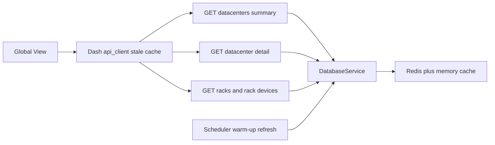

# Global View Cache Entegrasyon Planı

## Kapsam ve Bulgular

Global View sayfası [src/pages/global_view.py](/Users/namlisarac/Desktop/Work/Datalake-Platform-GUI/src/pages/global_view.py) üzerinden yalnızca datacenter-api uçlarını kullanıyor: `/api/v1/datacenters/summary`, `/api/v1/datacenters/{dc_code}`, `/api/v1/datacenters/{dc_code}/racks` ve `/api/v1/datacenters/{dc_code}/racks/{rack_name}/devices`. Customer-api ve query-api bu sayfanın kritik path’inde değil.

Mevcut cache zaten iki katmanlı:

- Dash tarafı: [src/services/api_client.py](/Users/namlisarac/Desktop/Work/Datalake-Platform-GUI/src/services/api_client.py) içinde `api:datacenters_summary:*`, `api:dc_details:*`, `api:dc_racks:*`, `api:rack_devices:*` key’leri ve hata durumunda stale fallback.
- Backend tarafı: [services/datacenter-api/app/services/dc_service.py](/Users/namlisarac/Desktop/Work/Datalake-Platform-GUI/services/datacenter-api/app/services/dc_service.py) içinde `all_dc_summary:{start}:{end}`, `dc_details:{dc}:{start}:{end}`, `global_dashboard:{start}:{end}`, `dc_racks:{dc}`, `rack_devices:{rack}` key’leri. Redis + memory cache altyapısı [services/datacenter-api/app/core/cache_backend.py](/Users/namlisarac/Desktop/Work/Datalake-Platform-GUI/services/datacenter-api/app/core/cache_backend.py) içinde.

Önerilen entegrasyon yeni endpoint eklemek değil; Global View’in kullandığı mevcut datacenter cache path’lerini daha güvenilir hale getirmek.

## Uygulama Planı

1. Backend summary/detail cache path’ini singleflight ile güçlendir.

- [services/datacenter-api/app/services/dc_service.py](/Users/namlisarac/Desktop/Work/Datalake-Platform-GUI/services/datacenter-api/app/services/dc_service.py) içinde `get_all_datacenters_summary()` cache miss durumunda direkt `_rebuild_summary(tr)` çağırmak yerine `cache.run_singleflight(cache_key, lambda: self._rebuild_summary(tr))` kullanmalı.
- `get_dc_details()` için de aynı desen uygulanmalı; cache miss olduğunda tek bir thread DB’den hesaplasın, diğer eşzamanlı istekler aynı key’i beklesin.
- Bu özellikle [src/pages/global_view.py](/Users/namlisarac/Desktop/Work/Datalake-Platform-GUI/src/pages/global_view.py) içindeki `build_region_detail_panel()` path’i için önemli; region drilldown aynı anda çok sayıda `get_dc_details()` çağırıyor.

2. Rack/floor-map cache path’ini aynı modele yaklaştır.

- `get_dc_racks()` ve `get_rack_devices()` zaten 6 saat TTL ile cache ediyor. Soğuk cache’te aynı rack/DC için eşzamanlı istek riski varsa bu iki path de `cache.run_singleflight(..., ttl=21600)` ile sarılmalı.
- Key formatı korunmalı: `dc_racks:{dc}` ve `rack_devices:{rack}`. Frontend `api_client` tarafındaki `api:dc_racks:*` / `api:rack_devices:*` key’lerine dokunmak gerekmiyor.

3. Global View callback’lerinde zaman aralığı tutarlılığını düzelt.

- [app.py](/Users/namlisarac/Desktop/Work/Datalake-Platform-GUI/app.py) içinde `open_3d_hologram_modal()` şu an `api.get_dc_details(dc_id, default_time_range())` kullanıyor. Callback’e `State("app-time-range", "data")` eklenmeli ve `time_range or default_time_range()` kullanılmalı.
- Böylece pin detail card, region detail panel ve 3D modal aynı cache key/time-range üzerinden çalışır.

4. Scheduler/warm-up davranışını koru, sadece doğrula.

- [services/datacenter-api/app/services/scheduler_service.py](/Users/namlisarac/Desktop/Work/Datalake-Platform-GUI/services/datacenter-api/app/services/scheduler_service.py) zaten startup’ta `warm_cache()` ve periyodik `refresh_all_data()` çağırıyor.
- [services/datacenter-api/app/services/dc_service.py](/Users/namlisarac/Desktop/Work/Datalake-Platform-GUI/services/datacenter-api/app/services/dc_service.py) içinde `warm_cache()`, `warm_additional_ranges()` ve `refresh_all_data()` zaten summary/detail/dashboard cache’lerini standard range’ler için dolduruyor. Bu davranış korunmalı; clear/delete yapılmamalı, mevcut “başarılı rebuild olunca overwrite” stratejisi devam etmeli.
- Not: `cache_time_ranges()` 7d, 30d ve previous_month içeriyor. UI’da 1h/1d seçilirse ilk istek cold miss olabilir; singleflight bunu güvenli hale getirir. 1h/1d warm-up eklemek opsiyonel tutulmalı, çünkü refresh maliyetini artırabilir.

5. Testleri ekle/güncelle.

- [services/datacenter-api/tests/test_dc_service.py](/Users/namlisarac/Desktop/Work/Datalake-Platform-GUI/services/datacenter-api/tests/test_dc_service.py) içinde `cache.run_singleflight` mock’lanarak `get_all_datacenters_summary()` ve `get_dc_details()` cache miss’te singleflight kullandığı test edilmeli.
- `get_dc_racks()` / `get_rack_devices()` singleflight ile sarılırsa TTL’nin `21600` geçtiği test edilmeli.
- [services/datacenter-api/tests/test_dc_endpoints.py](/Users/namlisarac/Desktop/Work/Datalake-Platform-GUI/services/datacenter-api/tests/test_dc_endpoints.py) endpoint time-range davranışı zaten kapsıyor; callback düzeltmesi için uygun mevcut Dash callback test altyapısı varsa `open_3d_hologram_modal` path’inde seçili time range’in `api.get_dc_details` çağrısına geçtiği test edilebilir. Yoksa düşük riskli manuel doğrulama notu yeterli.

6. Doğrulama.

- `pytest services/datacenter-api/tests/test_dc_service.py services/datacenter-api/tests/test_dc_endpoints.py`
- Mümkünse Global View manuel smoke test: `/global-view`, 30d seçimi, pin click, Detail/3D modal, region menu drilldown, floor map rack click.
