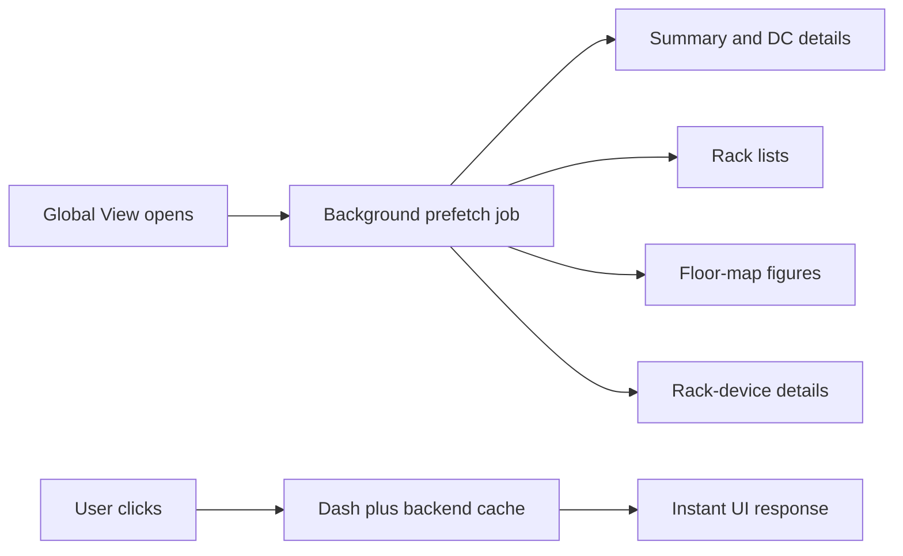

# Global View 15 Dakikalik Prefetch Plani

## Anladigim Ihtiyac

Global View acildiginda ilk veri cekilsin; sonraki 15 dakika boyunca kullanici haritada DC pinine, ayni DC pinine, floor map icindeki racklere veya tekrar ayni racke bastiginda bekleme yasamasin. Yani sadece backend cache degil, Dash worker icindeki `api_client` cache, `floor_map` figure cache ve rack-device detaylari da onceden sicak olsun.

Mevcut durumda:

- Backend Redis cache zaten hizli: `summary`, `dc_details`, `dc_racks`, `rack_devices` keyleri var.
- [src/services/api_client.py](/Users/namlisarac/Desktop/Work/Datalake-Platform-GUI/src/services/api_client.py) Dash process icinde stale cache tutuyor ama veriyi sadece fonksiyon cagrilinca dolduruyor.
- [src/pages/floor_map.py](/Users/namlisarac/Desktop/Work/Datalake-Platform-GUI/src/pages/floor_map.py) figure cache tutuyor ama figure ilk floor-map acilisinda uretiliyor.
- [app.py](/Users/namlisarac/Desktop/Work/Datalake-Platform-GUI/app.py) icinde `advance_to_floor_map()` rack listesini alip floor-map layoutunu o anda uretiyor; `show_rack_detail()` ise rack device listesini rack tiklaninca cekiyor.



## Uygulama Plani

1. Global View icin yeni bir prefetch servisi ekle.

- Onerilen dosya: [src/services/global_view_prefetch.py](/Users/namlisarac/Desktop/Work/Datalake-Platform-GUI/src/services/global_view_prefetch.py)
- Gorevi:
  - `api.get_all_datacenters_summary(tr)` ile summary cache'i doldurmak.
  - Summary icindeki DC id'leri icin `api.get_dc_details(dc_id, tr)` doldurmak.
  - Her DC icin `api.get_dc_racks(dc_id)` doldurmak.
  - Rack listesi geldikten sonra `build_floor_map_figure(racks, dc_id=dc_id)` cagirarak floor-map figure cache'i doldurmak.
  - Her rack icin `api.get_rack_devices(dc_id, rack_name)` cagirarak rack detail cache'i doldurmak.
- Bu islem kullanici requestini bloklamamali; background thread ile calismali.

2. 15 dakikalik TTL/refresh kontrolu koy.

- Prefetch servisi `time_range` bazli son warm-up zamanini tutmali.
- Ayni time range icin 15 dakika dolmadan ikinci warm-up baslatilmamali.
- Ayni anda birden fazla kullanici Global View acarsa tek warm-up calismali; digerleri mevcut isi tekrar baslatmamali.
- Onerilen aralik: `GLOBAL_VIEW_PREFETCH_INTERVAL_SECONDS = 900`.

3. Global View acilisinda warm-up tetikle.

- [src/pages/global_view.py](/Users/namlisarac/Desktop/Work/Datalake-Platform-GUI/src/pages/global_view.py) icinde `build_global_view(tr, ...)` summary aldiktan sonra background prefetch baslatilmali.
- Bu nokta dogru cunku sayfa zaten acilmis, time range belli, summary verisi mevcut.
- Prefetch baslatma UI renderini bekletmemeli.

4. 15 dakikada bir sessiz refresh icin interval ekle.

- Global View layoutuna `dcc.Interval(id="global-prefetch-interval", interval=900000, ...)` eklenebilir.
- [app.py](/Users/namlisarac/Desktop/Work/Datalake-Platform-GUI/app.py) icinde bu interval `app-time-range` ile prefetch servisini tetikler.
- Callback sadece background isi baslatmali ve UI output olarak hidden dummy div/store kullanmali; sayfayi yeniden render etmemeli.

5. Floor-map gecisini anlik hale getir.

- `advance_to_floor_map()` su anda `build_floor_map_layout(dc_id, dc_name, racks)` cagiriyor; prefetch sonrasi `build_floor_map_figure()` cache hit olacagi icin hizlanacak.
- Gerekirse `floor_map.py` icinde `build_floor_map_layout()` icin de hafif cache dusunulebilir, ama once figure cache + API cache yeterli gorunuyor.

6. Rack detail gecisini anlik hale getir.

- Prefetch tum rackler icin `api.get_rack_devices(dc_id, rack_name)` cagiracagi icin `show_rack_detail()` tiklamada app-level cache hit almalidir.
- Bos device donen racklerde panel yine rack identity/status/U/hall bilgilerini gostermeli ve cihaz bolumunde “No devices found for this rack” placeholder'i kalmali.

7. Is yukunu kontrollu tut.

- Rack-device prefetch concurrency sinirli olmali: ornegin `ThreadPoolExecutor(max_workers=6)`.
- Hata alan rack/DC tum isi bozmasin; hata loglanip devam edilsin.
- Prefetch sadece Global View acikken tetiklenmeli; app startup'ta tum dunyayi zorunlu isitmasin.

8. Debug instrumentation temizligi.

- Daha once eklenen gecici `_agent_debug_log` bloklari artik gerekiyorsa kaldirilmali veya normal logger'a donusturulmeli.
- Kalici gozlem icin prefetch servisi `logger.info` ile su metrikleri yazmali: `dc_count`, `rack_count`, `device_request_count`, `elapsed_ms`, `skipped_due_to_ttl`.

## Dogrulama

- Container icinde `python -c "import src.pages.global_view; import src.pages.floor_map"` hatasiz olmali.
- `/global-view` acildiktan sonra ilk warm-up logunda DC/rack/device sayilari gorulmeli.
- 15 dakika dolmadan tekrar tetiklenirse `skipped_due_to_ttl=true` logu gorulmeli.
- 15 dakika dolunca refresh tekrar calismali.
- `DC13` gibi yuksek rack sayili DC icin:
  - `summary` ve `racks` API milisaniye seviyesinde kalmali.
  - floor-map gecisi cache hit ile hissedilir bekleme yaratmamali.
  - rack tiklamalari ilk tiklamada da hizli gelmeli.

## Executor Prompt

```text
Goal: Make Global View interactions feel instant for 15-minute windows by prefetching/warming the whole click path, not just backend responses.

Context:
- Backend Redis cache is already fast and should not be redesigned.
- Dash app has app-level cache in src/services/api_client.py, but it fills lazily.
- Floor-map figure cache is in src/pages/floor_map.py and is fast once warmed.
- Current slow path: Global View -> click DC -> click same DC -> floor map -> click rack -> rack device detail. We need these to be warmed after Global View opens and refreshed every 15 minutes.

Tasks:
1. Add a new module src/services/global_view_prefetch.py.
2. Implement a background prefetch service with 15-minute per-time-range throttling and single in-flight job protection.
3. For a given time_range, prefetch in this order:
   - api.get_all_datacenters_summary(time_range)
   - api.get_dc_details(dc_id, time_range) for all DCs in summary
   - api.get_dc_racks(dc_id) for all DCs
   - build_floor_map_figure(racks, dc_id=dc_id) for all DCs with racks
   - api.get_rack_devices(dc_id, rack_name) for all racks
4. Use bounded concurrency for detail/rack-device warming, e.g. ThreadPoolExecutor(max_workers=6). Do not let one failing DC/rack abort the whole prefetch.
5. In src/pages/global_view.py, trigger prefetch asynchronously when build_global_view() runs. It must not block page render.
6. Add a dcc.Interval to Global View, interval=900000 ms, and a lightweight callback in app.py that triggers the same prefetch for the current app-time-range. The callback should not rerender the page.
7. Preserve existing backend cache behavior and existing floor_map.py figure cache. Do not add cachetools dependency.
8. Add logging with logger.info for prefetch start/skip/done: time_range, dc_count, rack_count, device_request_count, elapsed_ms.
9. Remove temporary agent debug file-log instrumentation if still present; use normal logger for permanent observability.
10. Validate in container:
    - python -c "import src.pages.global_view; import src.pages.floor_map"
    - Open /global-view with 30D
    - Confirm prefetch done log appears
    - DC13 floor-map transition is fast after warm-up
    - First click on DC13 rack detail is fast, not only repeated clicks

Acceptance criteria:
- Global View opens normally and starts background prefetch.
- No user-visible blocking during prefetch.
- Within the 15-minute warm window, DC pin repeat, floor-map open, and rack detail clicks use warmed caches.
- 15-minute interval refresh overwrites caches silently.
- High-rack DCs like DC13 remain responsive.
```